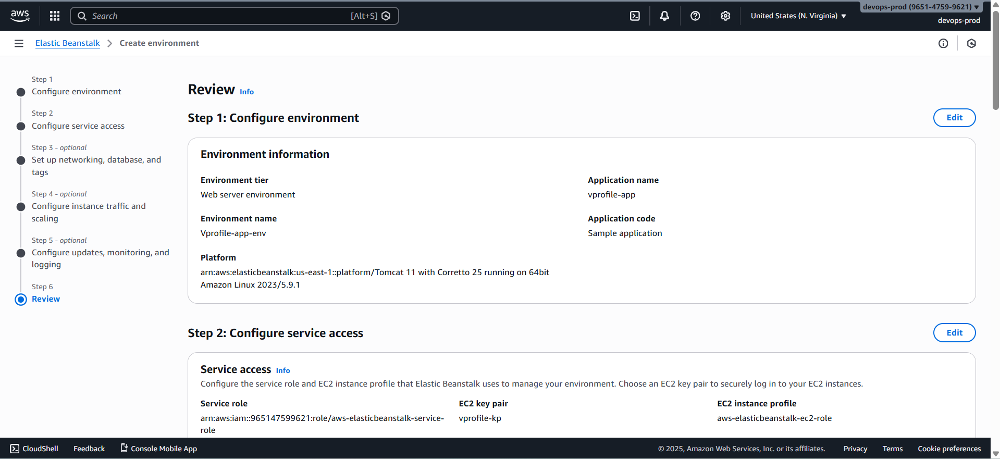
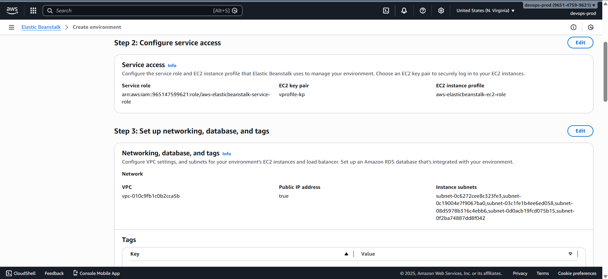
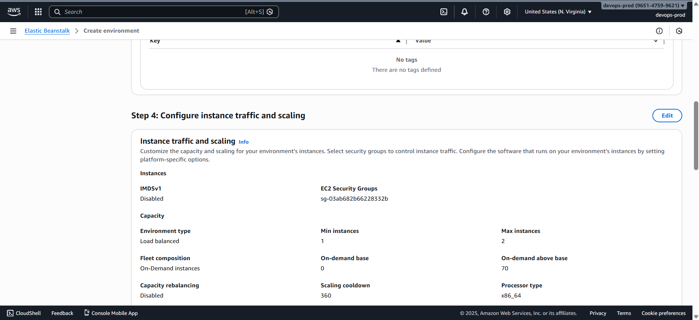
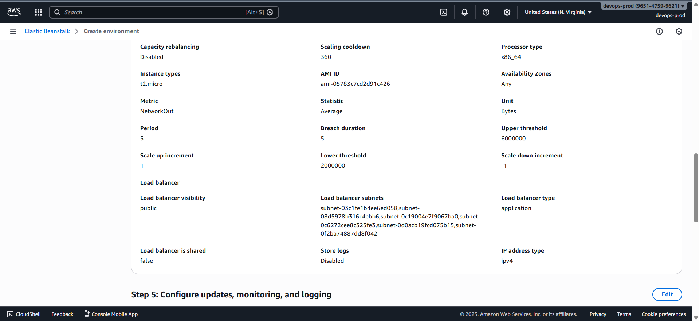
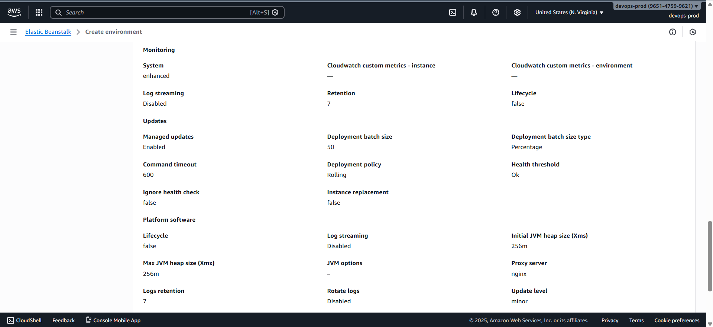

# 🚀 Setting Up Elastic Beanstalk for Application Deployment

This section walks through creating an **AWS Elastic Beanstalk** application and environment that will serve as the **deployment target** for the Continuous Delivery pipeline.

### 📌 Prerequisite

Before proceeding, complete the **Continuous Integration on AWS** project.
This ensures you already have:

- A working CI pipeline
- A source repository with application code
- Reusable build and analysis jobs

The CI project is the foundation for this CD setup.

### ❓ Why AWS Elastic Beanstalk?

Elastic Beanstalk is a **Platform as a Service (PaaS)** that removes the need to manage:

- EC2 instances
- Load balancers
- Auto Scaling groups
- OS patching and runtime configuration

This aligns perfectly with the goal of **minimal to zero operations overhead**.

### 1️⃣ Create an Elastic Beanstalk Application

1. Open the AWS Console
2. Search for **Elastic Beanstalk**
3. Click **Create application**
4. Choose **Web server environment**

#### Application Details

- **Application name**

  ```text
  vprofile-app
  ```

- **Environment name**

  ```text
  vprofile-app-env
  ```

### 2️⃣ Platform Configuration

- **Platform**: Tomcat
- **Version**: Tomcat 10 with Corretto 25
- **Configuration preset**: Custom configuration

> Corretto is AWS’s managed Java distribution.



### 3️⃣ IAM Role and EC2 Key Pair

#### IAM Instance Profile

- Select **Use existing service role**
- Choose:

  ```text
  vprofile-beanstalk-role
  ```

> If the role is not visible, refer to the **Re-Architecture Web App on AWS** project (Elastic Beanstalk lecture).

#### EC2 Key Pair

Required to:

- SSH into Beanstalk EC2 instances
- Perform database initialization later

If not available:

1. Go to **Amazon EC2 → Key Pairs**
2. Create:

   ```text
   vprofile-kp
   ```

3. Refresh and select the key in Beanstalk

### 4️⃣ Networking Configuration

- **VPC**: Default VPC
- **Public IP**: Enabled
- **Subnets**: Select all available subnets



This allows instances to launch across multiple AZs.

### 5️⃣ Capacity and Auto Scaling

#### Environment Type

- **Load balanced environment**

#### Auto Scaling

- **Minimum instances**: 1
- **Maximum instances**: 2

### Instance Type

- Select:

  ```text
  t2.micro  (or t3.micro)
  ```

This ensures high availability with cost efficiency.

### 6️⃣ Enable Session Stickiness

The **vProfile application is stateful**, so session stickiness is required.

1. Go to **Processes**
2. Edit process configuration
3. Enable **Stickiness**
4. Save changes

> Without stickiness, users may be routed to different instances and lose sessions.





### 7️⃣ Monitoring and Deployment Settings

#### Monitoring

- Keep default settings

#### Deployment Policy

- **Rolling deployment**
- **Batch size**: 50%

This provides **zero-downtime deployments**:

- 2 instances → 1 updates at a time



### 8️⃣ Review and Launch

1. Review all settings
2. Edit if required
3. Click **Submit**

Elastic Beanstalk will automatically:

- Launch EC2 instances
- Configure the load balancer
- Set up Auto Scaling
- Prepare the runtime environment

Provisioning takes a few minutes.
