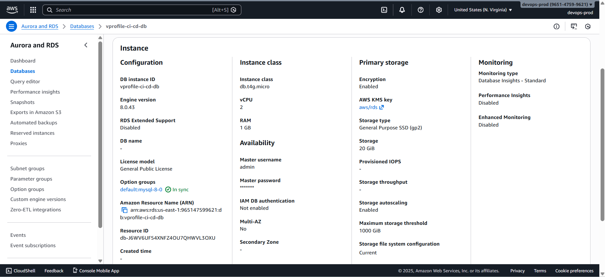

# 🗄️ Creating an Amazon RDS Database

The **vProfile application requires persistent database connectivity**.
In this step, we create a **MySQL database using Amazon RDS**, which will be consumed by the application deployed on **AWS Elastic Beanstalk**.

### ❓ Why Amazon RDS?

Amazon RDS is a fully managed database service that removes the need to:

- Install database software
- Patch or upgrade the operating system
- Manage backups manually
- Maintain database servers

This directly supports the project goal of **minimal operational overhead**.

### 1️⃣ Open the RDS Console

1. Open the AWS Console
2. Search for **RDS**
3. Open it in a new tab
4. Click **Create database**

### 2️⃣ Database Creation Method

- **Creation method**: Standard create
- **Engine type**: MySQL
- **Engine version**:

  ```text
  MySQL 8.0.43
  ```

- **Templates**: Free tier

> Selecting Free tier helps prevent accidental billing.

### 3️⃣ Database Configuration

#### DB Instance Details

- **DB instance identifier**

  ```text
  vprofile-ci-cd-db
  ```

- **Master username**

  ```text
  admin
  ```

- **Password**

  - Select **Auto-generate password**

⚠️ **Important**
Save the generated password immediately. It cannot be retrieved later without a reset.

### 4️⃣ Instance Class and Storage

- **Instance class**

  ```text
  db.t3.micro
  ```

- **Allocated storage**

  ```text
  20 GB (minimum)
  ```

Leave all other options as default.

### 5️⃣ Connectivity Settings

#### Network

- **VPC**: Default VPC
- **Public access**: No

#### Security Group

- Create a **new security group**
- **Security group name**

  ```text
  vprofile-ci-cd-rds-mysql-sg
  ```

> This security group will be updated later to allow access from Elastic Beanstalk.

### 6️⃣ Additional Configuration

- **Database port**: 3306 (default)
- **Monitoring**: Default
- **Initial database name**

  ```text
  accounts
  ```

> The `accounts` database is required by the vProfile application.

### 7️⃣ Create the Database

1. Review all settings
2. Confirm **Free tier** selection
3. Click **Create database**

### 8️⃣ Save Database Credentials

Once creation starts:

1. Click **View credential details**
2. Save:

   - Username
   - Password

⚠️ Losing the password requires a manual reset.

### 9️⃣ Wait for Database Availability

- Status changes to **Available**
- Typically takes **5–10 minutes**

At the same time, verify that:

- Elastic Beanstalk environment is also **Ready**


