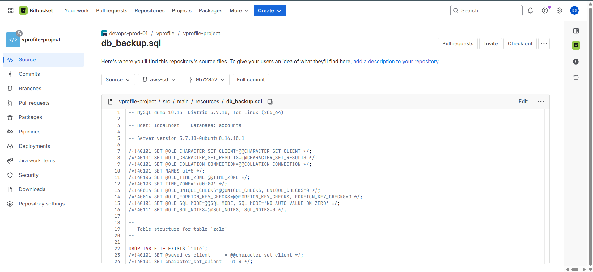
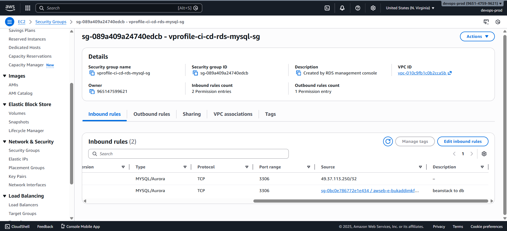
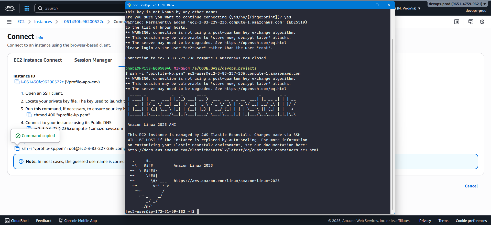
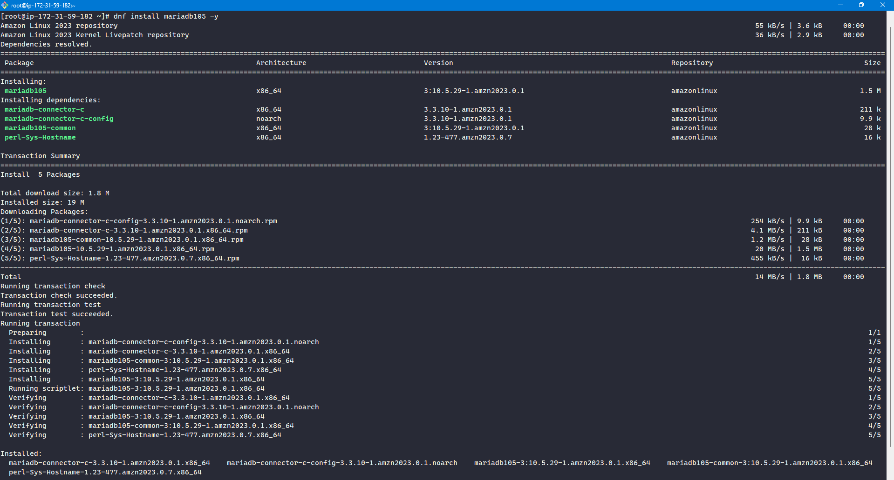
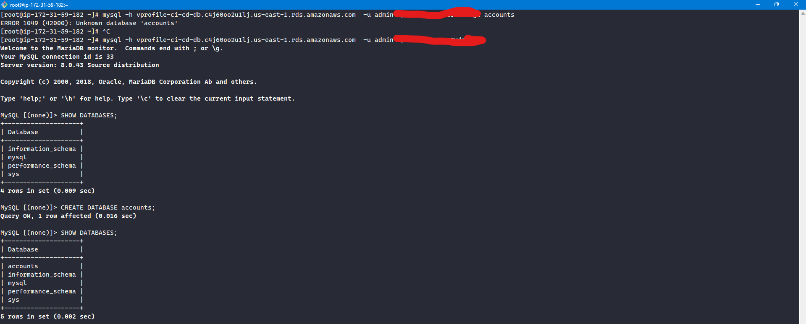
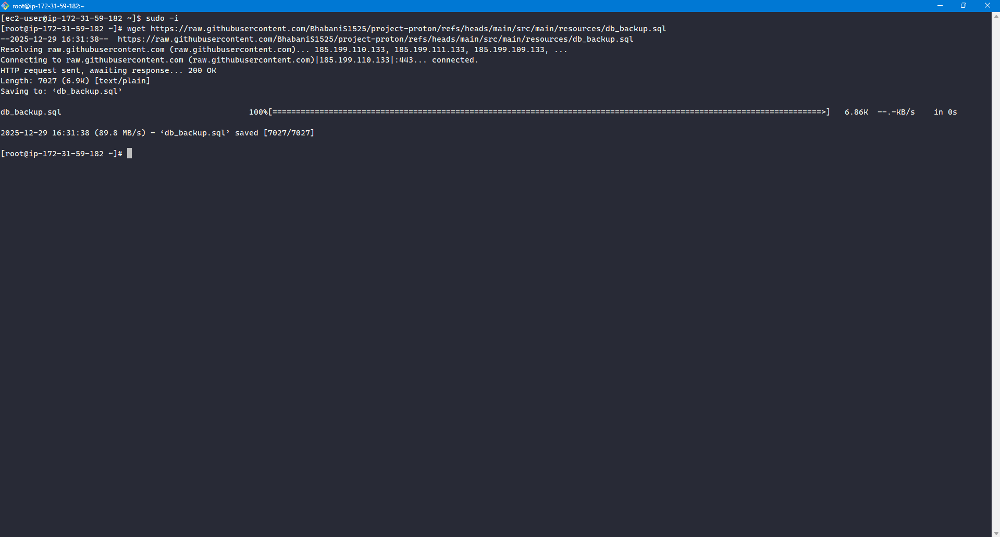
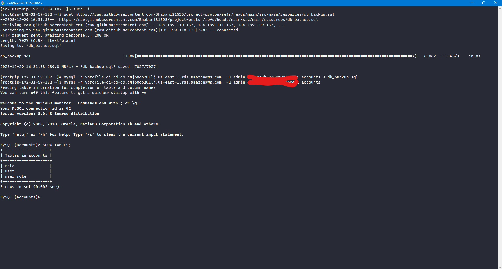

# 🗄️ Initializing the RDS Database for the vProfile Application

In this step, we initialize the **MySQL database hosted on Amazon RDS** with the schema required by the vProfile application.
The SQL schema is executed **from an EC2 instance managed by AWS Elastic Beanstalk**, because the RDS instance is not publicly accessible.

### 📌 Prerequisites

Before proceeding, ensure the following:

- RDS instance status is **Available**
- Elastic Beanstalk environment is **Running**
- You have access to:

  - RDS endpoint
  - Database username and password
  - Elastic Beanstalk EC2 key pair

### 1️⃣ Collect the RDS Endpoint

1. Open the **RDS Console**
2. Select the database instance
3. Copy the **Endpoint**
4. Store it securely for later use

### 2️⃣ Identify the Database Schema File

The database schema is provided by the development team in the source repository.

- **Repository**

  ```text
  https://bitbucket.org/devops-prod-01/vprofile-project/src/aws-cd/
  ```

- **Branch**

  ```text
  aws-cd
  ```

- **SQL file path**

  ```text
  src/main/resources/db_backup.sql
  ```

This file contains all required tables and seed data.



### 3️⃣ Allow RDS Access from Beanstalk Instances

RDS access must be explicitly allowed using **security group rules**.

#### Identify Beanstalk Instance Security Group

1. Go to **EC2 → Instances**
2. Select a Beanstalk-managed EC2 instance
3. Copy the **Instance Security Group ID**

⚠️ Do **not** use the Load Balancer security group.

#### Update RDS Security Group

1. Open the RDS security group:

   ```text
   vprofile-ci-cd-rds-mysql-sg
   ```

2. Edit **Inbound rules**
3. Add a rule:

   - **Type:** MySQL / Aurora
   - **Port:** `3306`
   - **Source:** Beanstalk EC2 instance security group

4. Save the rule

This restricts database access to Beanstalk instances only.



### 4️⃣ SSH into the Beanstalk EC2 Instance

1. Copy the **public IP** of a Beanstalk EC2 instance
2. Connect using the key pair:

```bash
ssh -i vprofile-beanstalk-cicd.pem ec2-user@<INSTANCE_PUBLIC_IP>
```

For Linux/macOS, ensure correct permissions:

```bash
chmod 400 vprofile-beanstalk-cicd.pem
```



#### 🔐 Security Best Practice

- Do **not** allow SSH from `0.0.0.0/0`
- Restrict SSH access to **your IP only**
- This is critical for production-like environments

### 5️⃣ Install MySQL Client

Once logged into the instance:

```bash
sudo -i
dnf install mariadb105 -y
```

Verify installation:

```bash
mysql --version
```



### 6️⃣ Connect to the RDS MySQL Database

Use the RDS endpoint and credentials:

```bash
mysql -h <RDS_ENDPOINT> -u admin -p accounts
```

- Enter the password when prompted
- `accounts` is the database name created earlier

Verify connection:

```sql
SHOW TABLES;
```

At this stage, the database should be empty.



### 7️⃣ Download the SQL Schema File

From the same Beanstalk EC2 instance:

1. Open the SQL file in a browser
2. Click **Raw**
3. Copy the raw file URL

Download it using:

```bash
wget <RAW_SQL_FILE_URL>
ls
```

Expected file:

```text
dbbackup.sql
```



### 8️⃣ Initialize the Database Schema

Execute the SQL file against the database:

```bash
mysql -h <RDS_ENDPOINT> -u admin -p accounts < dbbackup.sql
```

Verify initialization:

```bash
mysql -h <RDS_ENDPOINT> -u admin -p accounts
SHOW TABLES;
```

All application tables should now be present.


