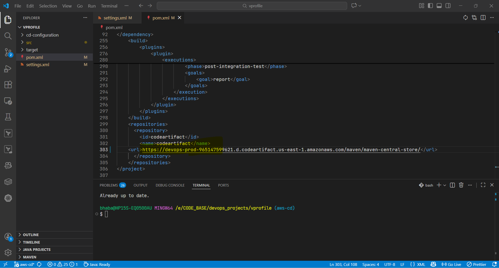
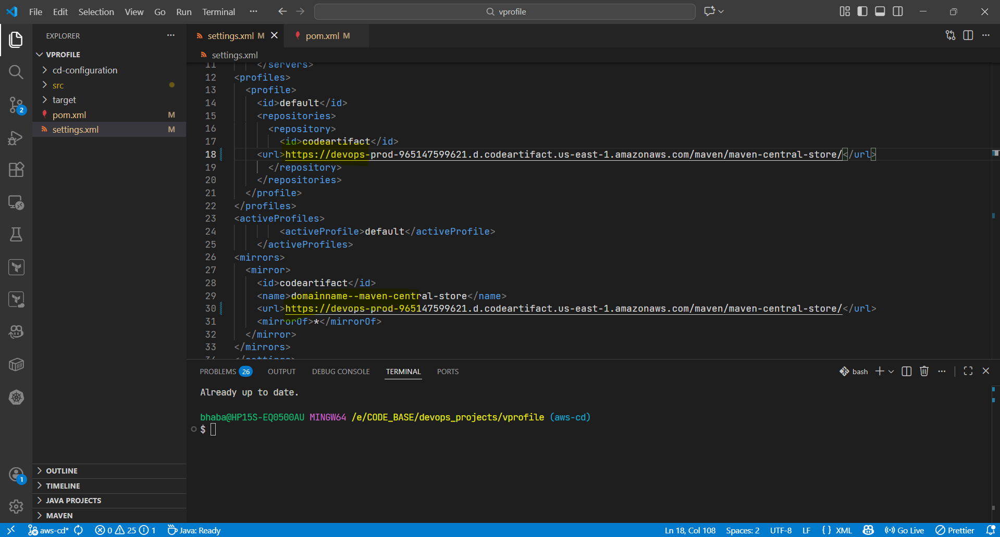

# 📦 Updating Maven Configuration for AWS CodeArtifact (CD Pipeline)

In this step, we update **`pom.xml`** and **`settings.xml`** so that Maven downloads dependencies from **AWS CodeArtifact** instead of public Maven repositories.
This configuration is required for the **Continuous Delivery (CD) pipeline**.

### 📌 Prerequisites

- An existing **AWS CodeArtifact** Maven repository (from the CI project)
- Source code repository cloned locally
- Working branch:

  ```text
  aws-cd
  ```

### ❓ Why This Update Is Required

By default, Maven pulls dependencies from **public Maven Central**.
For this project, all dependencies must be fetched via **AWS CodeArtifact** to:

- Meet security and compliance requirements
- Avoid reliance on the public internet
- Maintain consistency across CI and CD pipelines

### 1️⃣ Copy the CodeArtifact Maven Repository URL

1. Open the **AWS Console**
2. Navigate to **CodeArtifact**
3. Select your Maven repository
4. Click **View connection instructions**
5. Choose **Maven** as the package manager
6. Copy the **repository URL**

> ⚠️ Ensure the URL includes **exactly one trailing slash (`/`)**.

### 2️⃣ Update `pom.xml`

1. Switch to the CD branch:

   ```text
   aws-cd
   ```

2. Open `pom.xml`
3. Scroll to the **`<repositories>`** section
4. Replace the existing (dummy) repository URL with the **CodeArtifact URL**



#### Notes

- Ensure:

  - Only **one trailing slash (`/`)**
  - No extra or missing characters

- This configuration defines **where Maven resolves dependencies from**

5. Save the file
6. Commit the change with a clear message:

```text
Update pom.xml to use AWS CodeArtifact
```

### 3️⃣ Update `settings.xml`

1. Open `settings.xml` in the same `aws-cd` branch
2. Replace the repository URL in **both locations**:

   - `<profiles>` section
   - `<mirrors>` section

3. Verify:

   - URL format is correct
   - Trailing slash is present

4. Save the file
5. Commit the change:

   ```text
   Update settings.xml with AWS CodeArtifact URL
   ```



### ✅ Validation Checklist

Before proceeding, confirm:

- Branch is **`cd-aws`**
- CodeArtifact URL is updated in:

  - `pom.xml`
  - `settings.xml` (two locations)

- URL formatting is correct (no double slashes, no missing slash)
- All changes are committed and pushed
