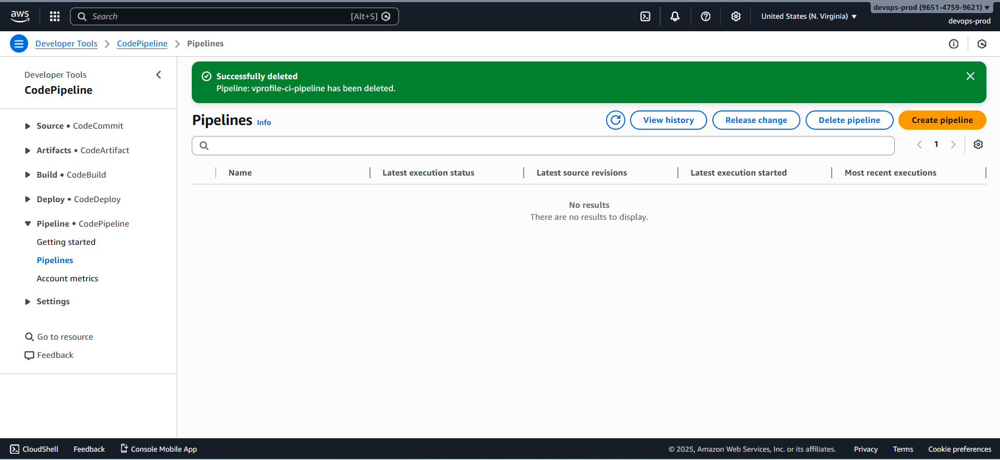
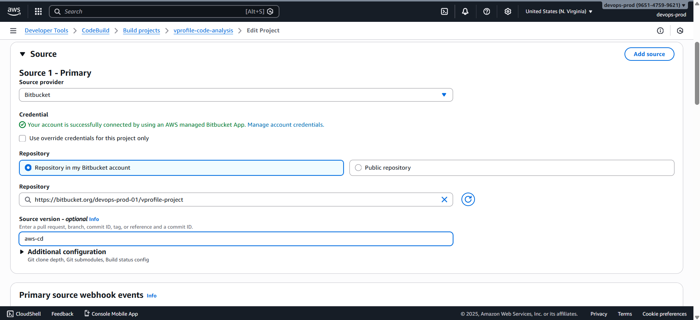
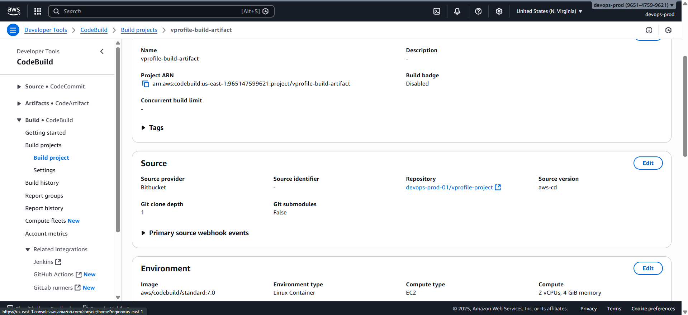
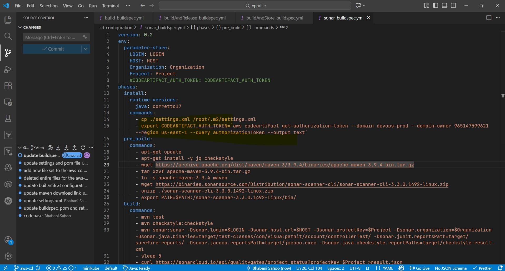
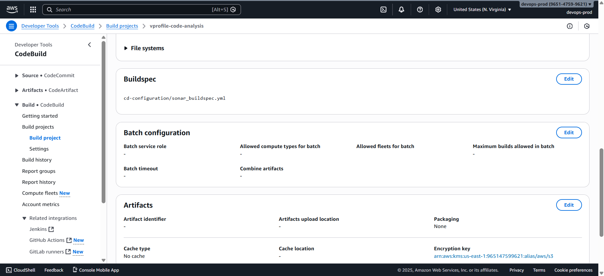
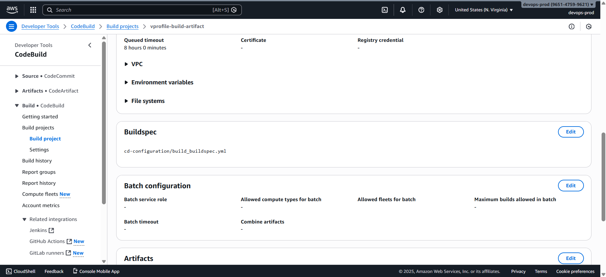

# 🧹 Preparing the Environment for Continuous Delivery on AWS

This section covers **cleanup, alignment, and readiness tasks** required before creating the **CodeBuild job that deploys artifacts to Elastic Beanstalk**.
No new services are introduced; existing resources are cleaned up and reconfigured for the **CD pipeline**.

### 📌 Prerequisite

- This project builds on **Continuous Integration on AWS**
- Existing **CodeBuild projects** and **CodeArtifact repositories** will be reused
- A new Git branch is used for Continuous Delivery:

  ```text
  aws-cd
  ```

### 1️⃣ Delete the Old CI Pipeline

The CI pipeline from the previous project is no longer required.

1. Open **AWS CodePipeline**
2. Select the pipeline:

   ```text
   vprofile-ci-pipeline
   ```

3. Delete the pipeline

This avoids confusion and ensures a clean CD pipeline setup.



### 2️⃣ Switch CodeBuild Projects to the CD Branch

In the CI project, CodeBuild jobs were configured to use the `ci-aws` branch.
For Continuous Delivery, all builds must point to:

```text
aws-cd
```

---

### Update Code Analysis Build Project

1. Open CodeBuild project:

   ```text
   vprofile-code-analysis
   ```

2. Click **Edit**
3. Update source branch to:

   ```text
   aws-cd
   ```

4. Save changes



### Update Artifact Build Project

1. Open CodeBuild project:

   ```text
   vprofile-build-artifact
   ```

2. Click **Edit**
3. Update source branch to:

   ```text
   aws-cd
   ```

4. Save changes



## 3️⃣ Record Existing CodeBuild IAM Role

- Note the **service role name** used by the existing CodeBuild projects
- Save it for reuse in upcoming deployment jobs

This avoids creating duplicate IAM roles unnecessarily.

### 4️⃣ Update Buildspec Files in the `aws-cd` Branch

Navigate to the repository:

```text
Branch: aws-cd
Folder: cd-configurations/
```

There are **three buildspec files** used in the CD pipeline.

#### 4.1 Update Sonar Analysis Buildspec

**File**

```text
cd-configuration/sonar_buildspec.yml
```

**Action**

- Replace the CodeArtifact token export command
- Copy the correct command from:

  - AWS CodeArtifact → View connection instructions → Maven
  - Or from the `main` branch

⚠️ Preserve YAML indentation and formatting.

Commit the changes.

#### 4.2 Update Artifact Build Buildspec

**File**

```text
cd-configuration/build_buildspec.yml
```

**Action**

- Replace the CodeArtifact token export command
- Ensure syntax and indentation remain valid

Commit the changes.

#### 4.3 Update Deployment Buildspec

**File**

```text
cd-configuration/deploy_buildspec.yml
```

**Action**

- Replace the CodeArtifact token export command
- This buildspec will be used in the **next lecture** for Elastic Beanstalk deployment

Commit the changes.



### 5️⃣ Fix Buildspec Path for the Code Analysis Job

In the `aws-cd` branch:

- There is **no `buildspec.yml` in the repository root**
- The Sonar buildspec is located at:

  ```text
  cd-configuration/sonar_buildspec.yml
  ```

#### Update Code Analysis CodeBuild Configuration

1. Open **vprofile-code-analysis** project
2. Edit **Buildspec configuration**
3. Select **Use a buildspec file**
4. Set the path:

   ```text
   cd-configuration/sonar_buildspec.yml
   ```

5. Save changes

Without this update, CodeBuild would fail with _buildspec file not found_.




