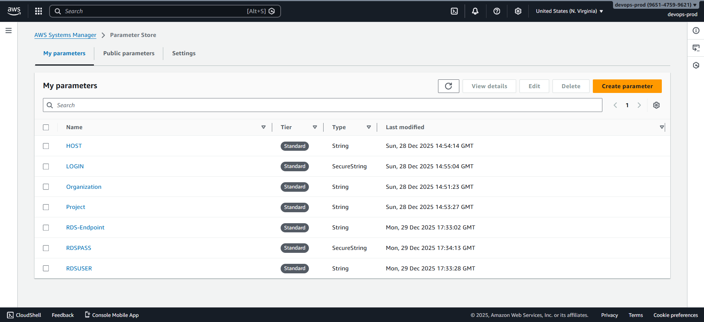
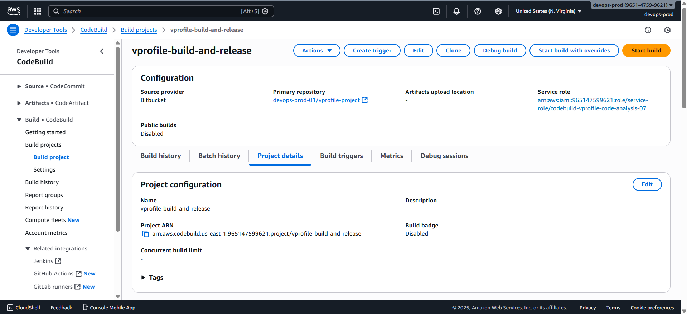
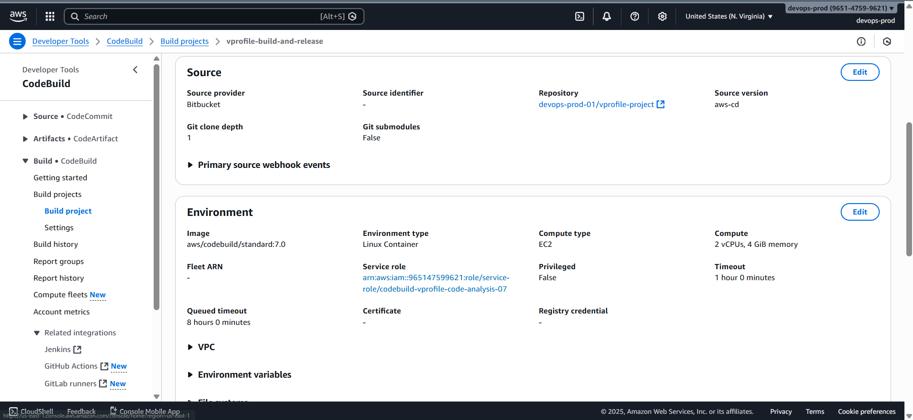
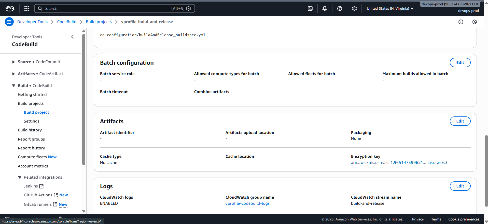
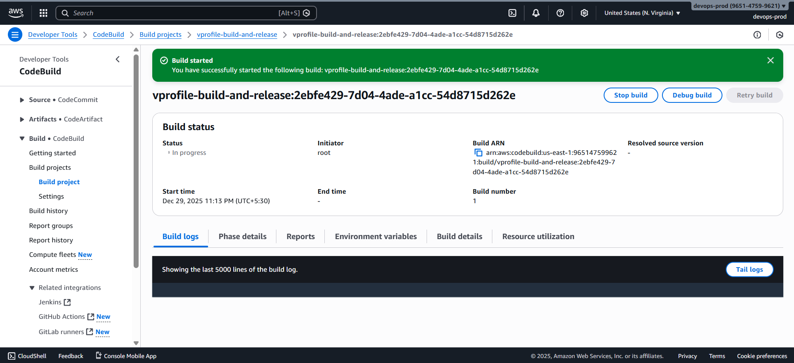
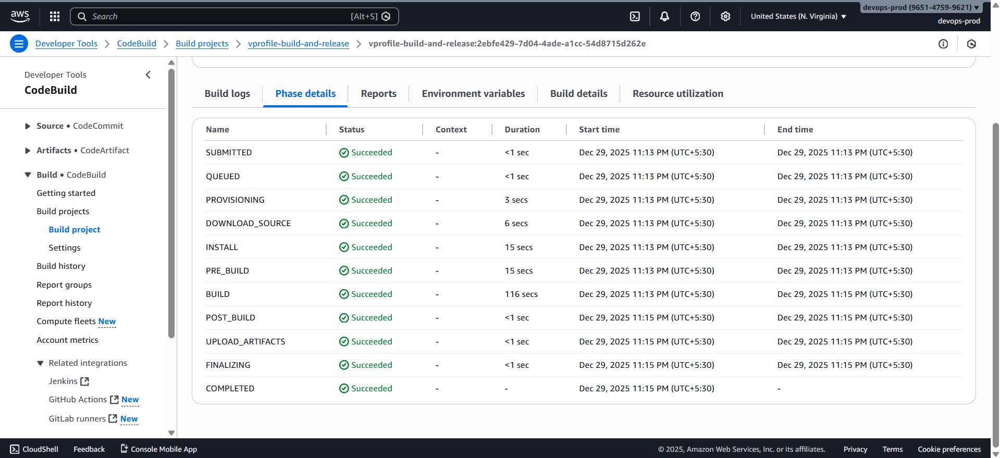

# 🚀 CodeBuild Job for Deploying to Elastic Beanstalk

In this step, we create a new **AWS CodeBuild project** responsible for **deploying the application to Elastic Beanstalk**.
This job is a **core stage of the Continuous Delivery (CD) pipeline** and handles artifact preparation, configuration injection, and deployment readiness.

### 📌 Prerequisites

Ensure the following before proceeding:

- Working Git branch:

  ```text
  aws-cd
  ```

- RDS database is **created and initialized**
- Existing CodeBuild **IAM service role** is available
- Elastic Beanstalk environment is **running**
- AWS CodeArtifact repository already exists

### 1️⃣ Understand the Deployment Buildspec

Navigate to the source repository:

```text
Branch: aws-cd
Path: cd-configuration/build-and-release-buildspec.yml
```

#### Purpose of This Buildspec

This buildspec performs the following actions:

- Reads **database connection details** from AWS Parameter Store
- Replaces JDBC values in `application.properties`
- Runs Maven build (`mvn install`)
- Prepares the artifact for deployment to Elastic Beanstalk

#### 🔐 How Database Configuration Is Injected

The application requires these database values:

- RDS endpoint
- Database username
- Database password

These values **must not be hardcoded** in the repository.

#### Approach Used

- Store values in **AWS Systems Manager Parameter Store**
- Fetch them dynamically during the build
- Use `sed` to replace values in `application.properties`

This ensures **secure, environment-specific configuration** without exposing secrets.

### 2️⃣ Create Parameters in Parameter Store

Open **Systems Manager → Parameter Store** and create the following parameters.

#### Parameter 1: RDS Endpoint

- **Name**

  ```text
  rds-endpoint
  ```

- **Type**: String
- **Value**: RDS endpoint (from RDS console)

#### Parameter 2: RDS Username

- **Name**

  ```text
  rds-user
  ```

- **Type**: String
- **Value**

  ```text
  admin
  ```

#### Parameter 3: RDS Password

- **Name**

  ```text
  rds-pass
  ```

- **Type**: SecureString
- **Value**: RDS password

> ⚠️ Always use **SecureString** for credentials.



### 3️⃣ Identify the Existing CodeBuild IAM Role

Reuse the IAM role created during the CI project.

1. Open an existing CodeBuild project (e.g., code analysis job)
2. Click **Edit**
3. Copy the **Service role name**
4. Save it for reuse

This role already includes permissions for:

- AWS CodeArtifact
- AWS Parameter Store
- Amazon CloudWatch Logs

### 4️⃣ Create the Deployment CodeBuild Project

Open **AWS CodeBuild**.

#### Basic Configuration

- **Project name**

  ```text
  vprofile-build-and-release
  ```

- **Source provider**: Bitbucket
- **Repository**: vprofile project
- **Branch**

  ```text
  aws-cd
  ```

  

#### Environment Configuration

- **Operating system**: Ubuntu
- **Image**: Standard 7.0
- **Service role**: Reuse the existing IAM role

#### Buildspec Configuration

- Select **Use a buildspec file**
- **Buildspec path**

  ```text
  cd-configuration/build-and-release-buildspec.yml
  ```

⚠️ Verify carefully:

- Path is correct
- No extra spaces
- Filename matches exactly
  Otherwise, CodeBuild will fail with _YAML file not found_.



#### Logs Configuration

- **CloudWatch Log Group**: Use the same group as other jobs
- **Log stream name**

  ```text
  build-and-release
  ```



### 5️⃣ Create and Test the Build Job

1. Click **Create build project**
2. After creation, click **Start build**
3. Monitor **Phase details**
4. Wait for completion





If the build fails, verify:

- Parameter names match exactly
- IAM role permissions
- Buildspec path correctness
- YAML syntax and indentation
