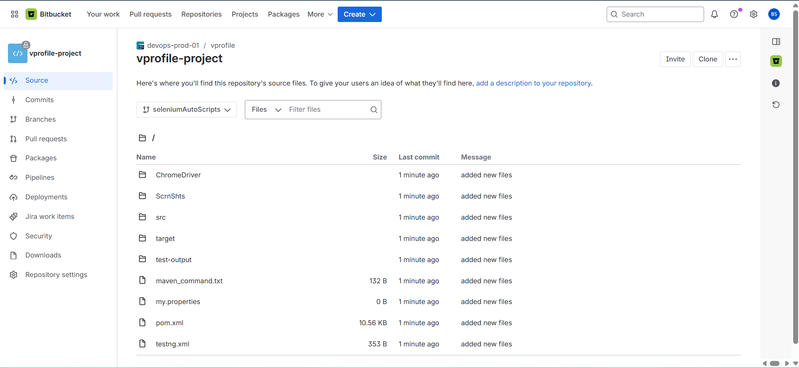
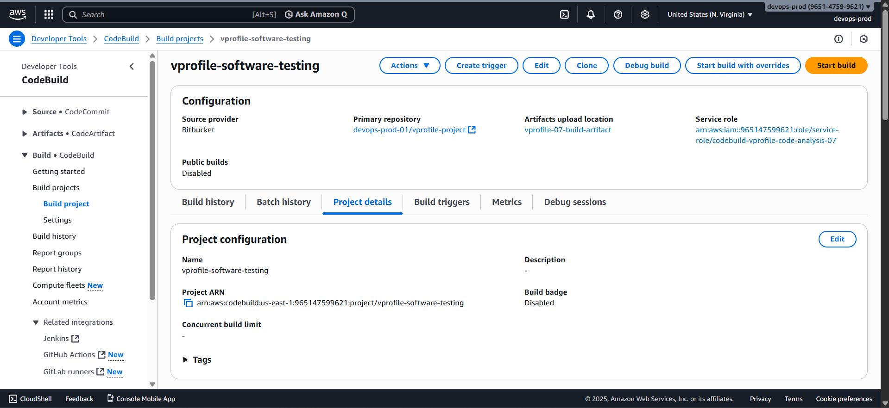
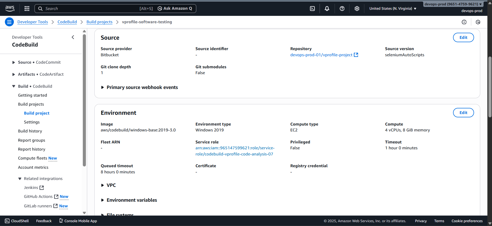
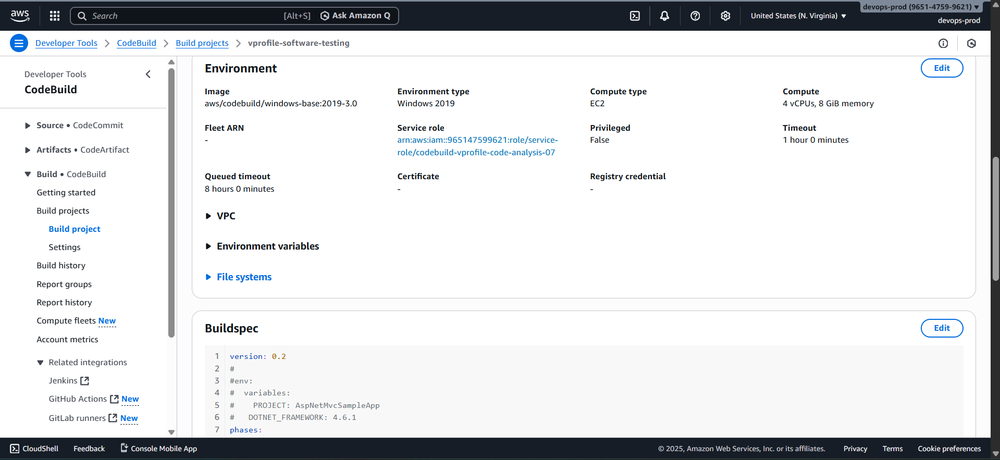
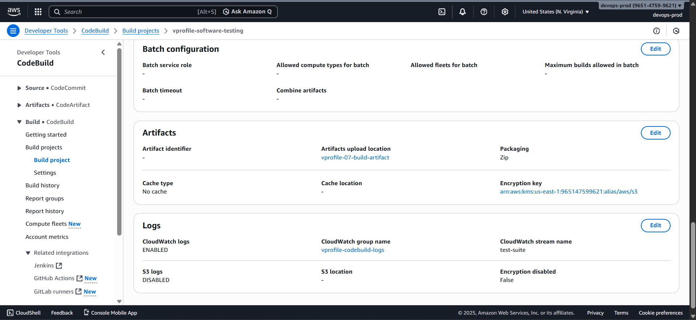

# 🧪 Creating the Selenium Software Testing CodeBuild Job

This section describes how to create the **final AWS CodeBuild job** in the Continuous Delivery pipeline.
The job executes **automated Selenium tests** against the application deployed on **AWS Elastic Beanstalk** and stores test results in **Amazon S3**.

### 🎯 Purpose of This Job

After the application is:

1. Built
2. Deployed to Elastic Beanstalk

we must **validate functionality automatically**.

This job performs the following:

- Fetches Selenium automation scripts
- Executes test cases using Maven
- Captures screenshots and logs
- Uploads test artifacts to Amazon S3

This completes the **end-to-end Continuous Delivery validation flow**.

### 🌿 Branch Used for Testing

This job uses a **dedicated branch**:

```text
Selenium Auto Scripts
```

This branch contains:

- Selenium test automation code
- Maven project configuration
- Selenium-specific buildspec logic



### 📋 Information Required Before Creating the Job

Collect the following before proceeding:

#### 1️⃣ IAM Service Role

Reuse the **existing AWS CodeBuild service role** created earlier for CI/CD jobs.
This role already includes permissions for:

- CloudWatch Logs
- S3 access
- CodeBuild execution

#### 2️⃣ S3 Bucket for Test Results

Create a new S3 bucket:

- Example name:

  ```text
  vprofile-07-build-artifact/selenium-test
  ```

- Requirements:

  - Globally unique
  - Same AWS region as CodeBuild

This bucket will store:

- Selenium screenshots
- Test execution logs
- Zipped test artifacts

#### 3️⃣ CloudWatch Log Group

Reuse the **same CloudWatch log group** used by previous CodeBuild jobs to keep logs centralized.

#### 4️⃣ Elastic Beanstalk Endpoint

Copy the **Elastic Beanstalk application URL**, for example:

```text
http://vprofile-app-prod.us-east-1.elasticbeanstalk.com
```

This URL will be passed to Selenium tests as a runtime parameter.

### 1️⃣ Create the CodeBuild Project

Open **AWS CodeBuild** and click **Create project**.

#### Basic Configuration

- **Project name**

  ```text
  vprofile-software-testing
  ```

- **Source provider**: Bitbucket
- **Repository**: vprofile project
- **Branch name**

  ```text
  Selenium Auto Scripts
  ```

  

### 2️⃣ Environment Configuration

#### Environment Settings

- **Operating system**: Windows
- **Image version**: Standard 3.0

> Windows is required because Selenium tests rely on GUI-based Chrome execution.



#### Service Role

- Select **Existing service role**
- Choose the same role used by earlier CodeBuild jobs

### 3️⃣ Buildspec Configuration (Inline)

This job uses an **inline buildspec**, not a file from the repository.

1. Select **Insert build commands**
2. Click **Switch to editor**
3. Remove all existing content
4. Paste the Selenium buildspec from:

   ```text
   cd-configuration/selenium-buildspec.yml
   ```

#### ⚠️ Required Updates

Before saving the buildspec:

- Replace the placeholder Beanstalk URL with **your actual environment URL**
- Ensure the sleep duration is sufficient for your deployment timing



---

## 4️⃣ Artifact Configuration

### Artifact Settings

- **Artifact type**: Amazon S3
- **Bucket name**

  ```text
  vprofile-07-build-artifact
  ```

- Enable **semantic versioning**
- Artifacts are **zipped**

#### Stored Artifacts Include

- Selenium test code
- Execution logs
- Screenshots
- Test result files

### 5️⃣ Logging Configuration

- **CloudWatch Log Group**: Same as previous jobs
- **Log stream name**

  ```text
  test-suite
  ```



### 6️⃣ Create the Project

Click **Create build project**.

⚠️ **Do not run this job manually yet.**
This job must execute **after deployment**, which will be orchestrated using **AWS CodePipeline**.
