# 🔗 End-to-End Continuous Delivery Pipeline on AWS

At this stage, all required components for Continuous Delivery are already in place:

- Elastic Beanstalk application and environment
- Amazon RDS database
- CodeBuild projects for:

  - Code analysis
  - Artifact build
  - Build & release (deployment)
  - Selenium software testing

In this section, we **connect all components using AWS CodePipeline** to create a fully automated **Continuous Delivery (CD) pipeline**.

### ❓ Why AWS CodePipeline?

AWS CodePipeline enables us to:

- Automatically detect source code changes
- Orchestrate multiple build, deploy, and test stages
- Integrate CodeBuild, S3, Elastic Beanstalk, and SNS
- Implement a fully automated, cloud-native CD workflow

### 1️⃣ Create a New Pipeline

1. Open **AWS CodePipeline**
2. Click **Create pipeline**
3. Pipeline name:

   ```text
   vprofile-cd-pipeline
   ```

4. Select **Create new service role**

   - Add a numeric suffix (e.g., `07`) for uniqueness

5. Click **Next**

### 2️⃣ Configure Source Stage (Bitbucket)

#### Source Provider

- Provider: **Bitbucket**
- Select an existing Bitbucket connection
  (or click **Connect to Bitbucket** if not already configured)

#### Repository & Branch

- Repository: vProfile project
- Branch:

  ```text
  aws-cd
  ```

> ⚠️ This branch is critical.
> Any commit to `aws-cd` will automatically trigger the pipeline.

#### Trigger

- Trigger type: **No filter**
- Click **Next**

### 3️⃣ Initial Build & Deploy Selection (Temporary)

#### Build Provider

- Provider: **AWS CodeBuild**
- Project:

  ```text
  vprofile-build-and-release
  ```

- Input artifact: Source artifact
- Click **Next**

#### Deploy Provider

- Provider: **AWS Elastic Beanstalk**
- Select:

  - Application name
  - Environment name

- Click **Next**

#### Create Pipeline

- Click **Create pipeline**
- Immediately **Stop the execution**

> We will add the remaining stages before running the pipeline.

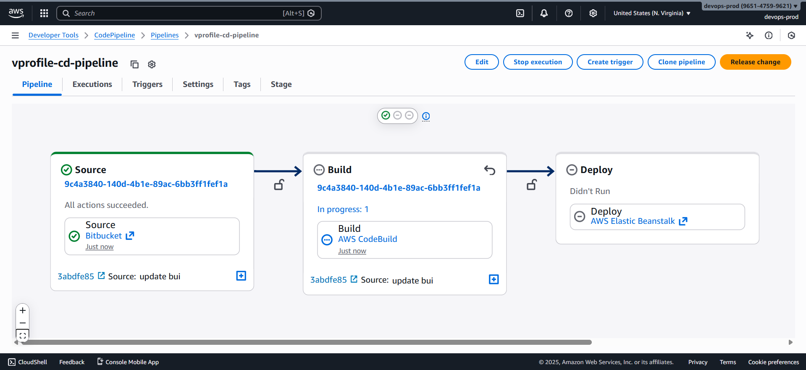

### 4️⃣ Edit the Pipeline to Add All Stages

Click **Edit** on the pipeline to add the missing stages.

#### Stage 1: Code Analysis

##### Configuration

- Stage name: `Code Analysis`
- Action provider: **AWS CodeBuild**
- Project: `vprofile-code-analysis`
- Input artifact: Source artifact
- Output artifact: Not required
  (Results are pushed to SonarCloud)

Save the stage.

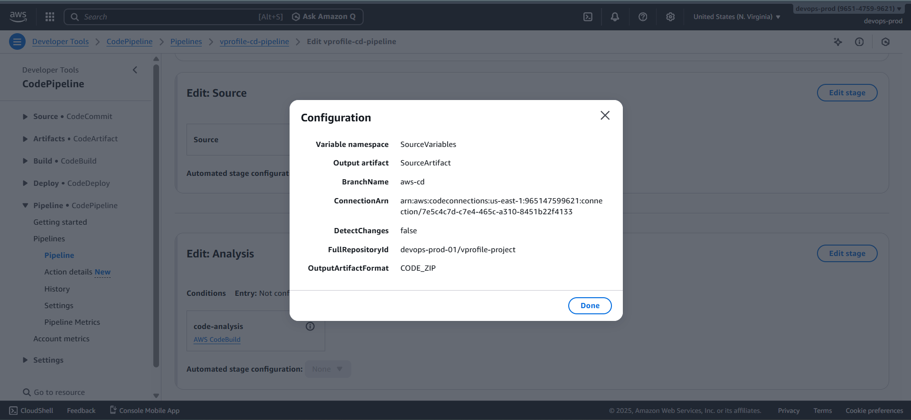

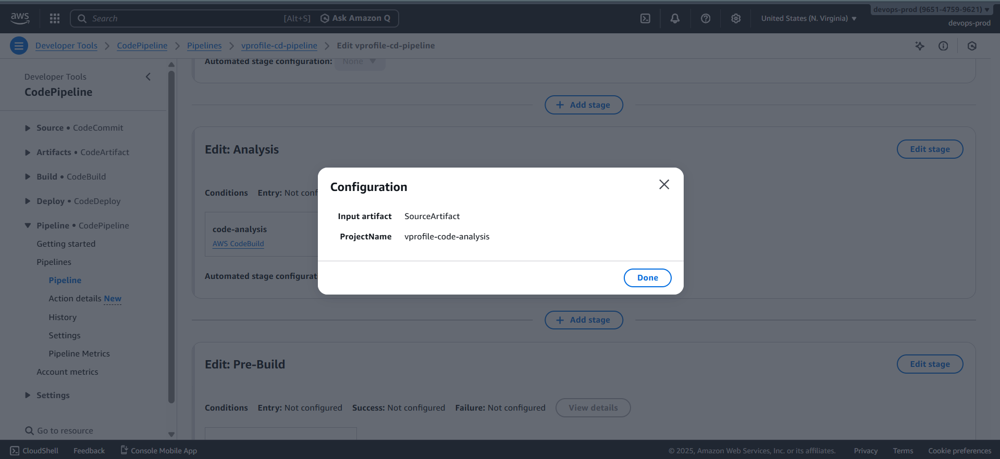

#### Stage 2: Build and Store Artifact

##### Configuration

- Stage name: `Build and Store`
- Action provider: **AWS CodeBuild**
- Project: `vprofile-build-artifact`
- Input artifact: Source artifact
- Output artifact name:

  ```text
  build-artifact
  ```

> ⚠️ Note this artifact name — it is used in later stages.

Save the stage.

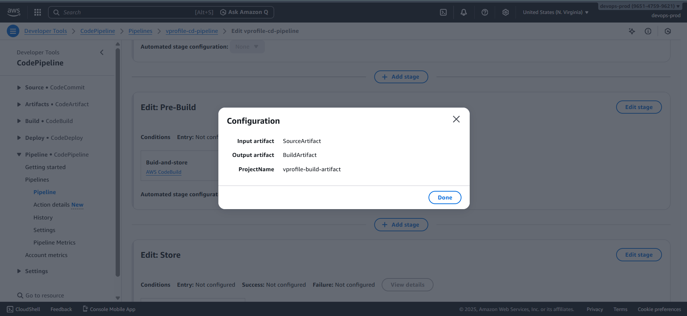

#### Stage 3: Deploy Artifact to S3

##### Configuration

- Stage name: `Deploy to S3`
- Action provider: **Amazon S3**
- Input artifact:

  ```text
  build-artifact
  ```

- Destination bucket:

  - S3 bucket created earlier for artifacts

- Enable **Extract before deploy**

This stage stores the build artifact in S3.

Save the stage.

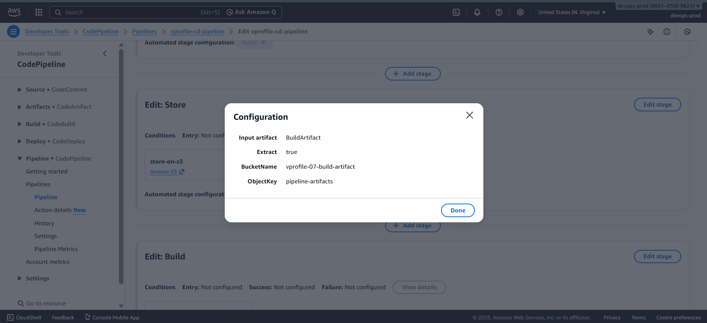

#### Stage 4: Build & Release to Elastic Beanstalk

##### Update Output Artifact Name

- Edit the **Build & Release** stage
- Set output artifact name:

  ```text
  build-artifact-to-bean
  ```

Save changes.

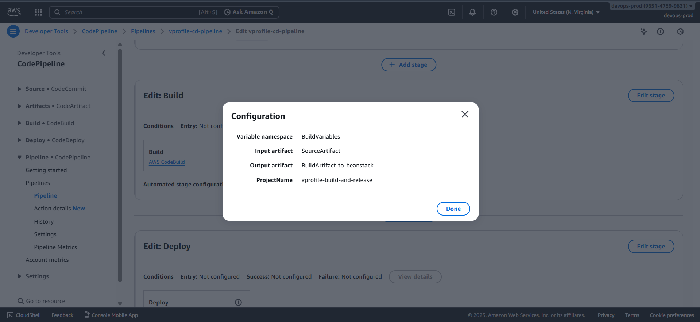

#### Deploy to Elastic Beanstalk

- Edit the Elastic Beanstalk deploy action
- Input artifact:

  ```text
  build-artifact-to-bean
  ```

- Select:

  - Beanstalk application
  - Beanstalk environment

This stage deploys the application to Elastic Beanstalk.

Save the stage.

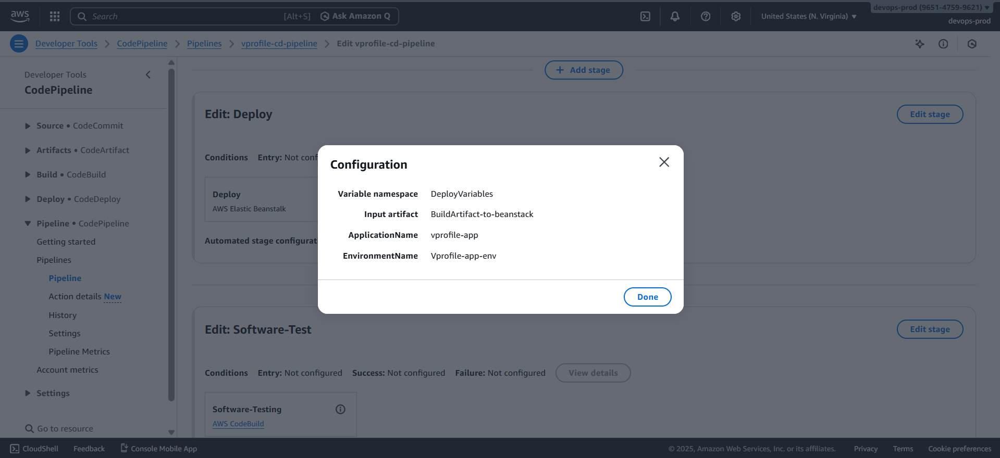

#### Stage 5: Software Testing (Selenium)

##### Configuration

- Stage name: `Software Testing`
- Action provider: **AWS CodeBuild**
- Project: `vprofile-software-testing`
- Input artifact: Source artifact

This stage:

- Executes Selenium test suite
- Validates the deployed application
- Stores test results in S3

Save the stage.

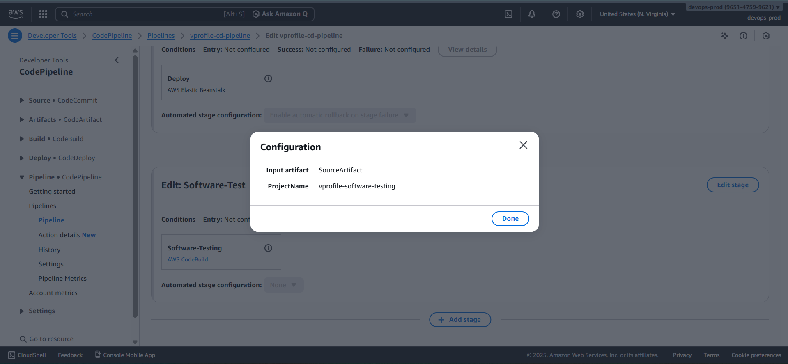

### 5️⃣ Save the Pipeline Configuration

Review the final stage order:

1. Code Analysis
2. Build and Store
3. Deploy to S3
4. Build & Release (Elastic Beanstalk)
5. Software Testing

Click **Save**.

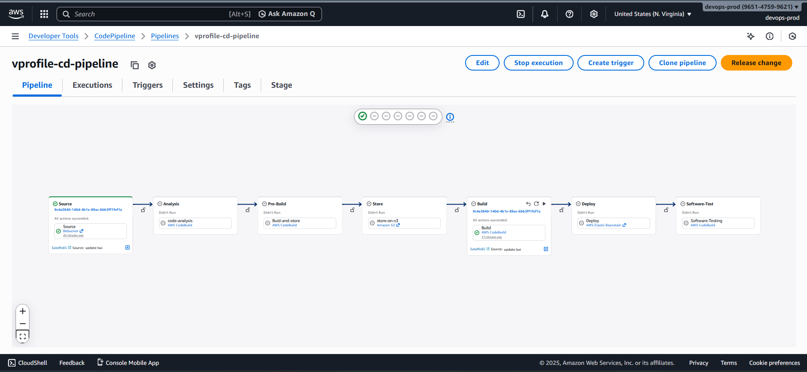

### 6️⃣ Configure Pipeline Notifications

### Create Notification Rule

1. Go to **Pipeline settings → Notifications**
2. Create a notification rule:

   - Name:

     ```text
     vprofile-cd-notifications
     ```

   - Detail type: **Full**
   - Events: **All**

3. Target:

   - Select the previously created SNS topic

4. Click **Submit**

This enables email notifications for:

- Pipeline success
- Failures
- Stage transitions

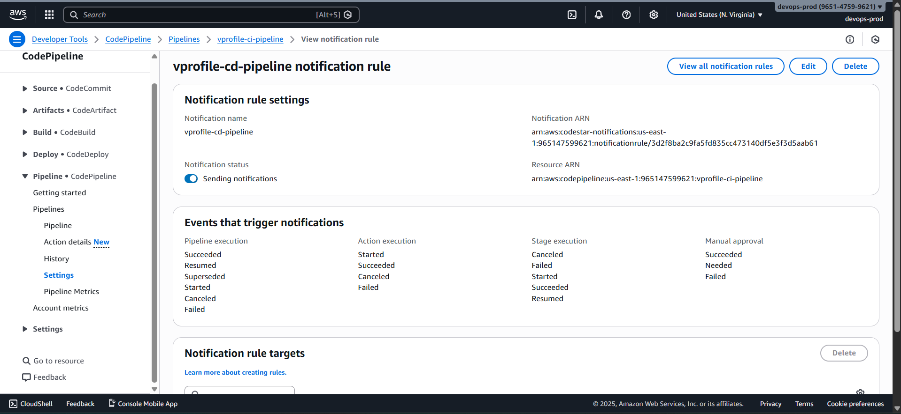

### 7️⃣ Enable Transitions & Release the Pipeline

- Ensure all stage transitions are **enabled**
- If you see **Enable transition**, click it
- Click **Release change**

The pipeline execution now begins.

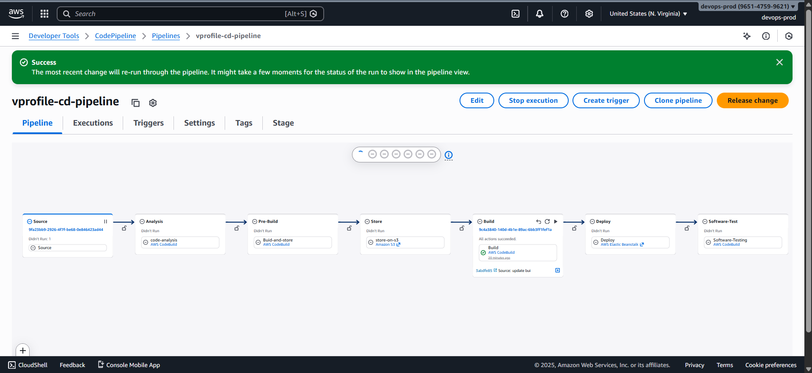

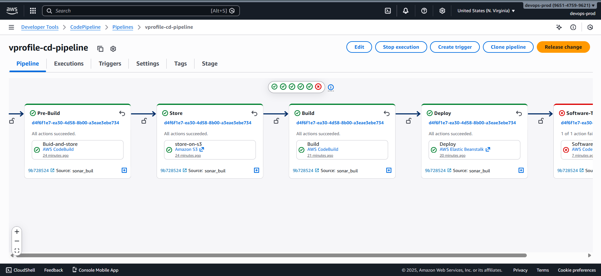

### 🔄 What Happens After Release

The pipeline executes in the following order:

1. Detects commit in Bitbucket (`aws-cd`)

2. Runs code analysis (SonarCloud)

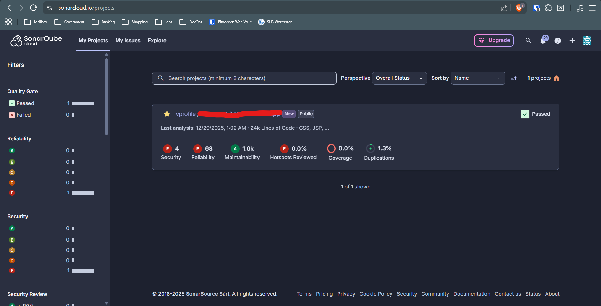

3. Builds the application artifact

4. Stores the artifact in S3

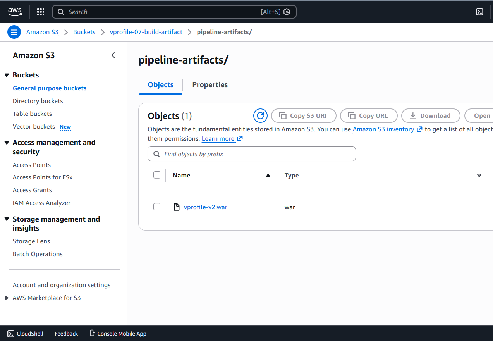

5. Deploys the application to Elastic Beanstalk

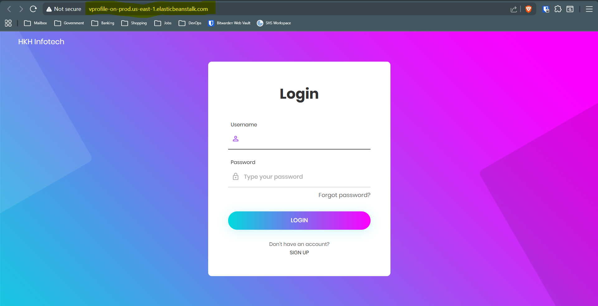

6. Executes Selenium software tests (Expected failure: as comsumed more than 90% of storage on free-tire. Hence, unable to build the windows instance)

7. Sends notifications via SNS
