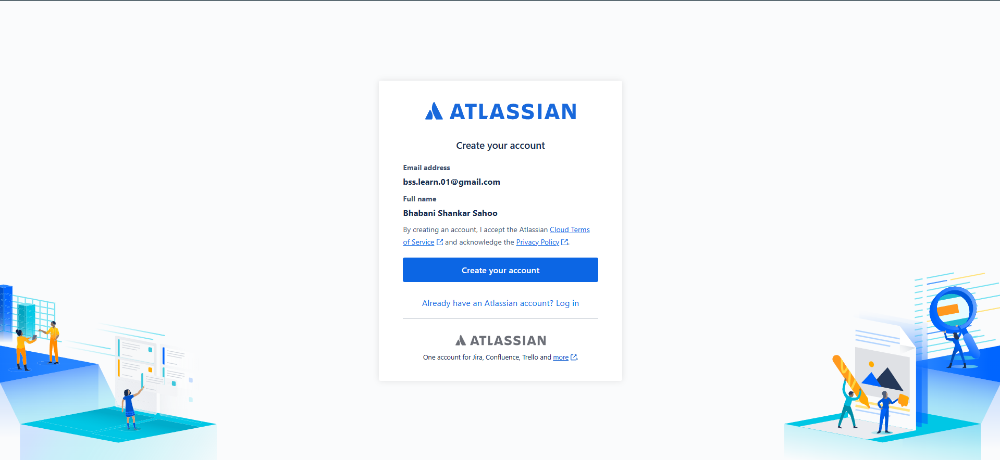
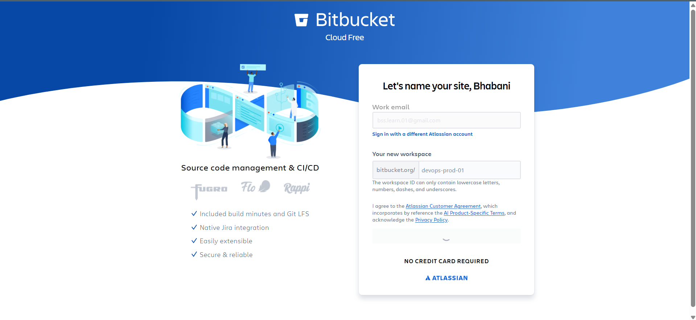
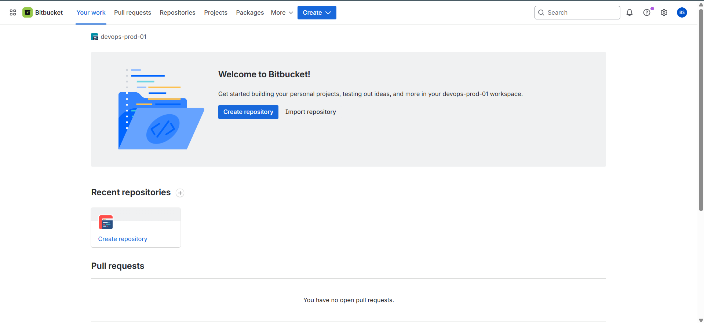
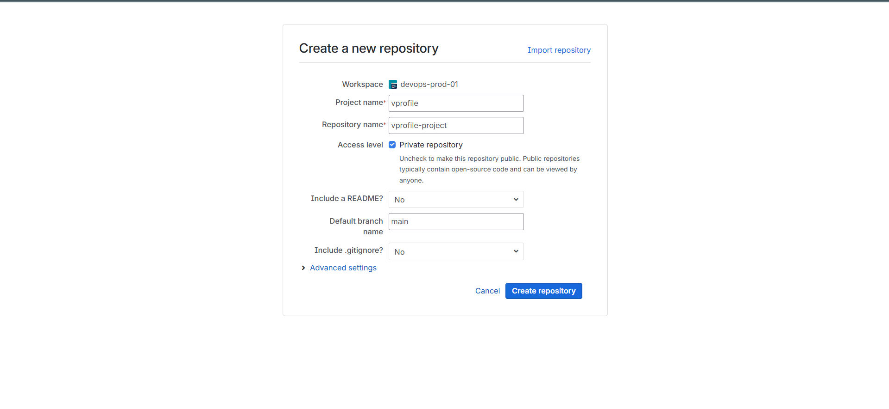
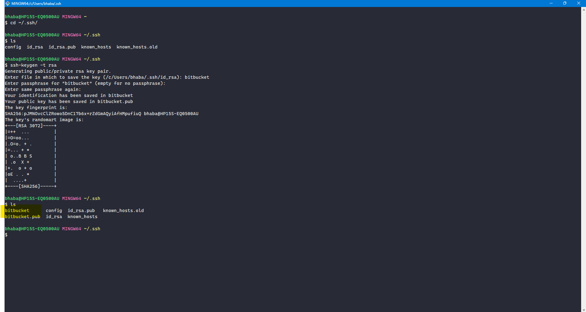
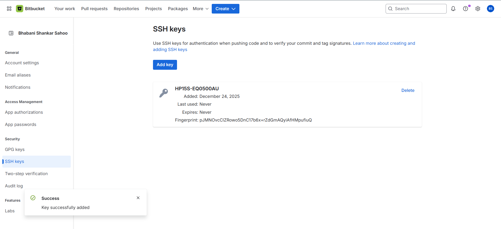
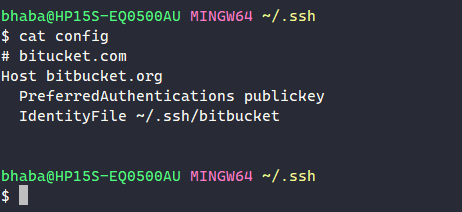
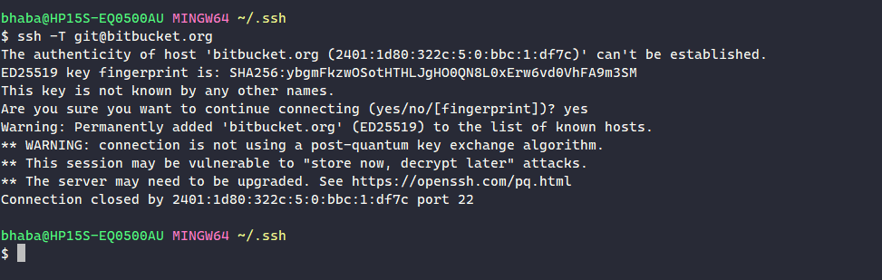
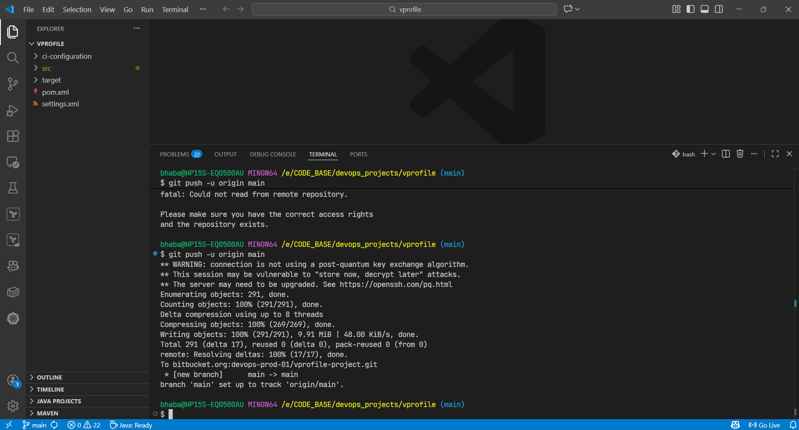
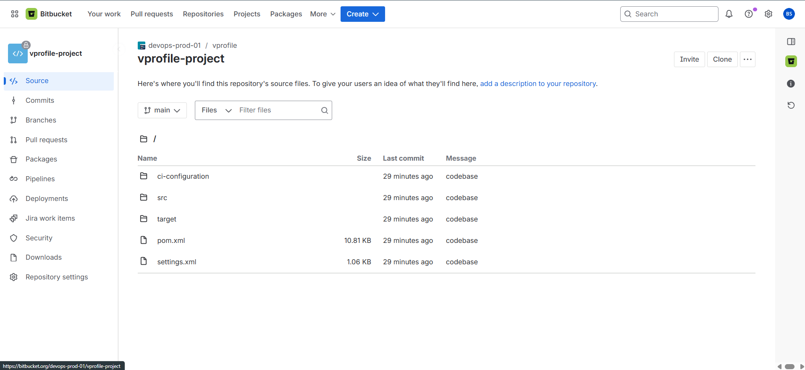

# 📦 Upload Source Code to Bitbucket

This section documents the process of Upload Source Code to **Bitbucket**, which will be used as the **source stage** for the AWS Continuous Integration pipeline.

### 1️⃣ Create a Bitbucket Account and Workspace

1. Go to **[https://bitbucket.org](https://bitbucket.org)**
2. Sign in using Google or another supported method
3. Create a **Workspace**

   - Workspace names must be globally unique
   - Workspaces are used to manage repositories and access control







### 2️⃣ Create an Empty Bitbucket Repository

1. Click **Create Repository**
2. Set:

   - **Project name:** `vprofile`
   - **Repository name:** `vprofile-project`

3. Ensure the repository is:

   - **Private**
   - **Empty** (no README, no `.gitignore`)

4. Create the repository



### 3️⃣ Generate SSH Keys for Bitbucket Authentication

On the local machine:

```bash
cd ~/.ssh
ssh-keygen -t rsa
```

When prompted for filename, enter:

```text
bitbucket
```

This generates:

- `bitbucket` (private key)
- `bitbucket.pub` (public key)



### 4️⃣ Add the Public SSH Key to Bitbucket

1. Copy the public key:

   ```bash
   cat ~/.ssh/bitbucket.pub
   ```

2. In Bitbucket:

   - Go to **Personal settings**
   - Navigate to **SSH keys**
   - Click **Add key**
   - Paste the public key and save



### 5️⃣ Configure SSH to Use the Correct Key

Edit or create the SSH config file:

```bash
vim ~/.ssh/config
```

Add the following:

```text
Host bitbucket.org
  PreferredAuthentications publickey
  IdentityFile ~/.ssh/bitbucket
```

Save and exit.



### 6️⃣ Verify SSH Connectivity

Test the SSH connection:

```bash
ssh -T git@bitbucket.org
```

Expected behavior:

- Authentication succeeds
- Message confirms Git access
- Shell access is disabled (expected)



### 🚀 Push Code to Bitbucket



### ✅ Verify Code

Open the Bitbucket repository and confirm:


