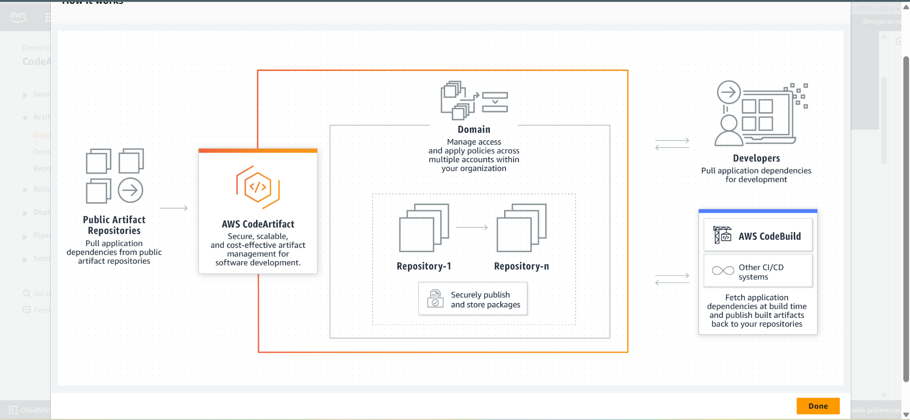
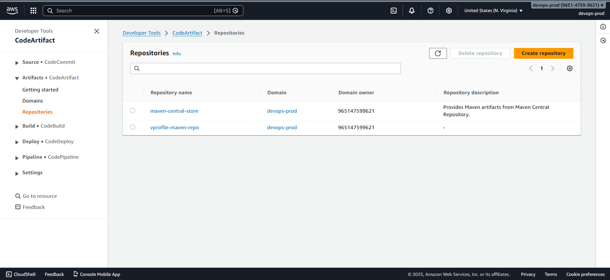
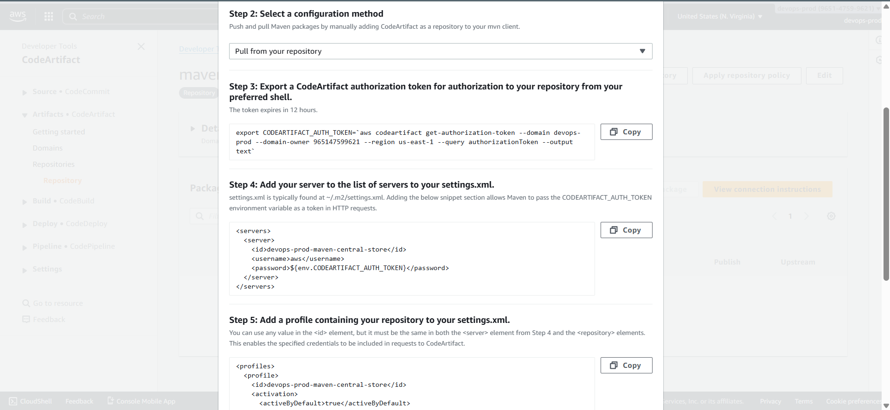

# 📦 Setting Up AWS CodeArtifact Repository

This section explains how **AWS CodeArtifact** is configured as a **private Maven dependency repository** for the CI pipeline, replacing direct access to public Maven repositories.



### ❓ Why AWS CodeArtifact?

By default, Maven downloads dependencies from **public repositories** on the internet when running commands like `mvn install`.
In many enterprise environments, this approach is restricted due to:

- Security concerns
- Compliance requirements
- Network isolation
- Dependency governance policies

**AWS CodeArtifact** enables organizations to host and control their own artifact repositories while securely proxying upstream dependencies.

### ⚙️ How CodeArtifact Works with Maven

- Acts as a **proxy repository**
- Connects to **Maven Central** as an upstream source
- Maven downloads dependencies **through CodeArtifact**, not directly from the internet
- Authentication is performed using a **temporary authorization token**
- Repository configuration is split across:

  - `pom.xml`
  - `settings.xml`

### 🏗️ Creating a CodeArtifact Repository

#### AWS Console Steps

1. Open the AWS Console
2. Search for **CodeArtifact**
3. Click **Getting Started**
4. Select **Create Repository**

#### Repository Configuration

- **Repository Name:** `vprofile-maven-repo`
- **Package Type:** Maven
- **Upstream Repository:** Maven Central Store
- **Domain Name:** (e.g., `devops-prod`)

After creation, the following repositories are visible:

- `maven-central-store`
- `vprofile-maven-repo` (used by the project)



### 🔐 Connecting Maven to CodeArtifact

CodeArtifact provides build-tool–specific connection instructions.

#### Authentication Model

- Maven authenticates using:

  - **Username:** `aws`
  - **Password:** CodeArtifact authorization token

- The token is generated using an **AWS CLI command**
- The token is exported as an environment variable
- `settings.xml` references this environment variable during builds



### 🛠️ AWS CodeBuild and buildspec.yml

AWS CodeBuild uses a file named **`buildspec.yml`** to define build logic and execution steps.

This serves a role similar to a **Jenkinsfile** in Jenkins pipelines.

### 🧱 Buildspec File Structure

#### 1️⃣ Environment Variables

- Uses **AWS Systems Manager Parameter Store**
- Stores sensitive values such as:

  - SonarCloud tokens
  - Project keys
  - Service URLs

#### 2️⃣ Install Phase

**Purpose:** Prepare runtime environment and authentication

Actions:

- Install **Java 17 (Amazon Corretto)**
- Copy `settings.xml` to Maven default location:

  ```text
  ~/.m2/settings.xml
  ```

- Generate and export CodeArtifact authorization token

This enables Maven to authenticate with CodeArtifact during the build.

#### 3️⃣ Pre-Build Phase

**Purpose:** Prepare tools required for analysis

Actions:

- Update packages using `apt`
- Install:

  - `jq`
  - `checkstyle`

- Download and configure:

  - Maven 3.9
  - Sonar Scanner CLI

- Add tools to the system `PATH`

#### 4️⃣ Build Phase

**Purpose:** Validate code quality and correctness

Commands executed:

- `mvn test` – Run unit tests
- `mvn checkstyle` – Static code analysis
- `mvn sonar:sonar` – Upload results to SonarCloud

Sonar parameters include:

- Project key
- Host URL
- Authentication token
- Checkstyle report path

### 🚦 Quality Gate Validation

- SonarCloud quality gate status is fetched using API calls
- Results are stored in a JSON file
- `jq` parses the response
- The build **fails automatically** if the quality gate fails

### 📄 Maven Configuration Files

#### pom.xml

- Defines:

  - Repository ID
  - CodeArtifact repository URL

- Specifies **where** dependencies are fetched from

#### settings.xml

- Defines **how** Maven authenticates
- Key sections:

  - `<servers>` – Authentication credentials
  - `<mirrors>` – Redirects Maven traffic to CodeArtifact

- Uses:

  - Username: `aws`
  - Password: `${env.CODEARTIFACT_AUTH_TOKEN}`

The token is injected dynamically at runtime from the environment.
