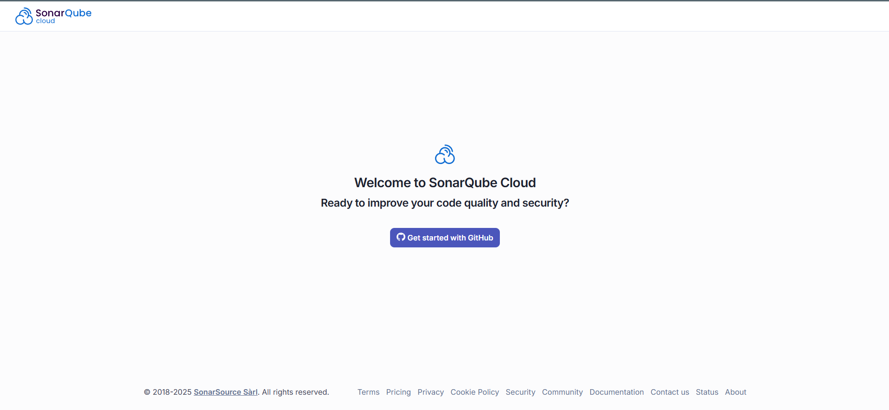
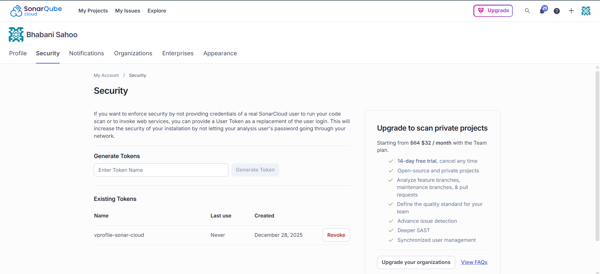
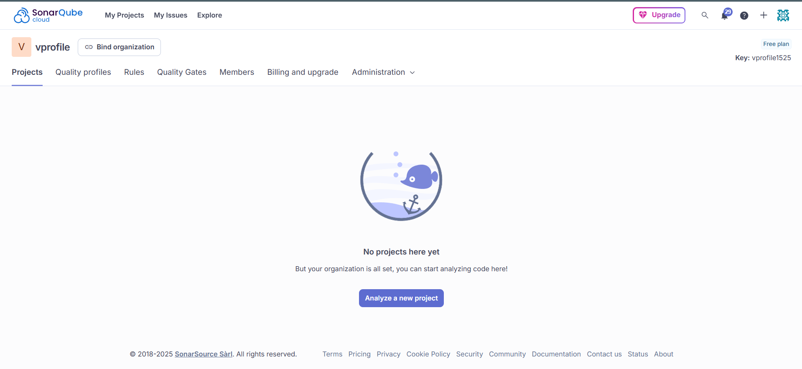
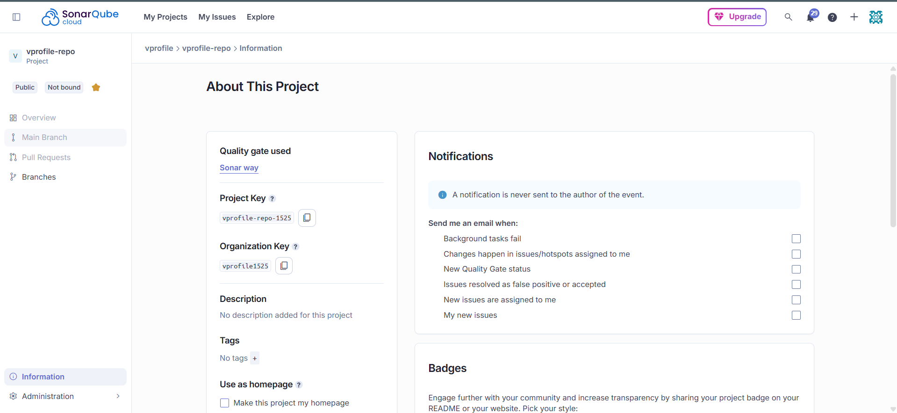

# 🔍 Setting Up a Project in SonarCloud

This section covers setting up **SonarCloud** for cloud-based static code analysis.
Instead of running a self-hosted SonarQube server, SonarCloud is used to align with a **fully cloud-native CI architecture**.

### ❓ Why SonarCloud?

In traditional Jenkins-based CI setups, a **self-managed SonarQube server** is commonly used for static code analysis.
In this project, **SonarCloud** is chosen to avoid server management and operational overhead.

### Benefits

- No server provisioning or maintenance
- Built-in scalability
- Native integration with cloud CI tools (e.g., AWS CodeBuild)
- Enforced quality gates for code standards

### 📌 Prerequisites

- A valid **GitHub account**
- A **SonarCloud account** (can be created using GitHub login)

#### 1️⃣ Log in to SonarCloud

1. Open a browser and navigate to:

   ```text
   https://sonarcloud.io
   ```

2. Click **Log in with GitHub**
3. Complete the signup process if logging in for the first time



#### 2️⃣ Generate SonarCloud Authentication Token

This token is required by **AWS CodeBuild** to authenticate with SonarCloud.

1. Click your **profile icon**
2. Select **My Account**
3. Open the **Security** tab
4. Enter a token name, for example:

   ```text
   vprofile-sonar-cloud
   ```

5. Click **Generate Token**
6. Copy and store the token securely



#### 3️⃣ Create a SonarCloud Organization

1. Click the **+** icon
2. Select **Create New Organization**
3. Choose **Create organization manually**
4. Provide:

   - **Organization Name** (must be unique)
   - Example: `vprofile`

5. Select the **Free Plan**
6. Click **Create Organization**



#### 4️⃣ Create a New SonarCloud Project

1. Click **Analyze New Project**
2. Select **Create a project manually**
3. Verify the correct organization is selected
4. Provide:

   - **Display Name:** `vprofile-repo`
   - **Project Key:** `vprofile-repo-1525`
     _(Must be unique)_

5. Set project visibility to **Public**
6. Click **Next**

#### 5️⃣ Configure New Code Definition

- Select **Previous Version** as the baseline
- All future analysis will be treated as **new code**
- Enables SonarCloud to:

  - Compare changes
  - Enforce quality gates on newly added or modified code

Click **Create Project**.



#### 6️⃣ Collect Required SonarCloud Details

From the project dashboard, note the following:

- **Project Key**
- **Organization Name**
- **SonarCloud URL**

  ```text
  https://sonarcloud.io
  ```

These values are required for:

- AWS CodeBuild `buildspec.yml`
- AWS Systems Manager Parameter Store
