# 🛠️ Creating an AWS CodeBuild Project for SonarCloud Analysis

This section documents how to create an **AWS CodeBuild project** that performs **SonarCloud static code analysis** using a `buildspec.yml` file and uploads analysis results to SonarCloud.

### ❓ Why AWS CodeBuild?

**AWS CodeBuild** is a fully managed CI service that eliminates server management.

#### Benefits

- Pay only for build execution time
- No server provisioning or maintenance
- Automatic scalability
- No 24×7 infrastructure costs

#### CodeBuild vs Jenkins

- Use **CodeBuild** for small to medium workloads
- Use **Jenkins** when managing many complex pipelines requiring centralized control

### 📌 Prerequisites

Ensure the following are completed before proceeding:

- AWS CodeArtifact repository is created
- SonarCloud project and authentication token are available
- SonarCloud values are stored in **AWS Systems Manager Parameter Store**
- Source code is pushed to **Bitbucket**
- Working branch is **`ci-aws`**

#### 1️⃣ Update Maven Configuration Files

**Update `pom.xml`**

1. Open **AWS CodeArtifact**
2. Select the Maven repository
3. Click **View connection instructions**
4. Copy the **repository URL**
5. Replace the repository URL in `pom.xml`
6. Ensure the URL ends with `/`
7. Save the file


**Update `settings.xml`**

Verify the following:

- Username remains:

  ```text
  aws
  ```

- Password uses environment variable:

  ```text
  ${env.CODEARTIFACT_AUTH_TOKEN}
  ```

- Replace CodeArtifact URLs in:

  - `<profiles>`
  - `<mirrors>`

Save the file.

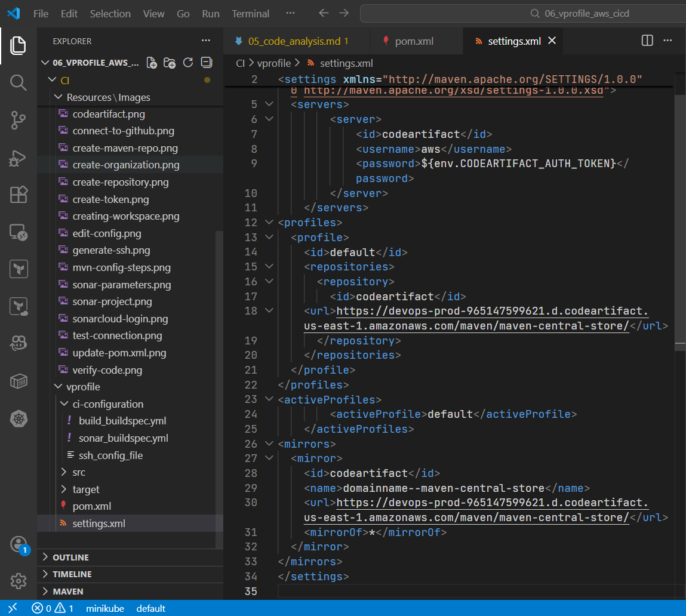

#### 2️⃣ Prepare the Buildspec File

1. Navigate to:

   ```text
   aws-files/buildspec-sonar.yml
   ```

2. Move the file to the **repository root**

   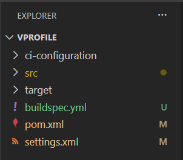

3. Rename it to:

   ```text
   buildspec.yml
   ```

4. Update the CodeArtifact token export command:

   - Copy the command from **CodeArtifact → Maven instructions**
   - Replace the placeholder command in `buildspec.yml`

5. Verify:

   - Parameter names match Parameter Store
   - Java version is correct
   - Maven, Sonar Scanner, and Checkstyle commands are intact

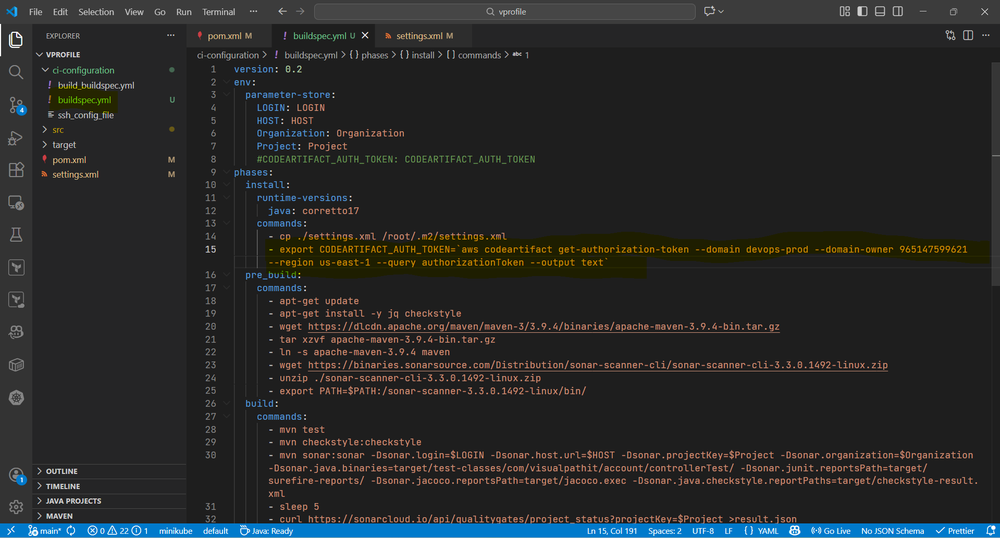

#### 3️⃣ Commit and Push Changes to Bitbucket

Commit the following files:

- `pom.xml`
- `settings.xml`
- `buildspec.yml`

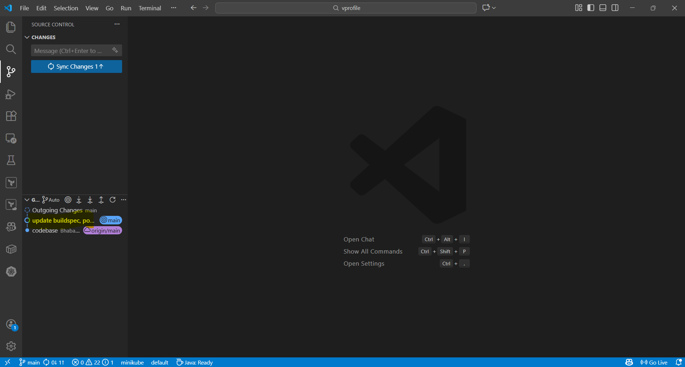

Push changes and verify them in Bitbucket.

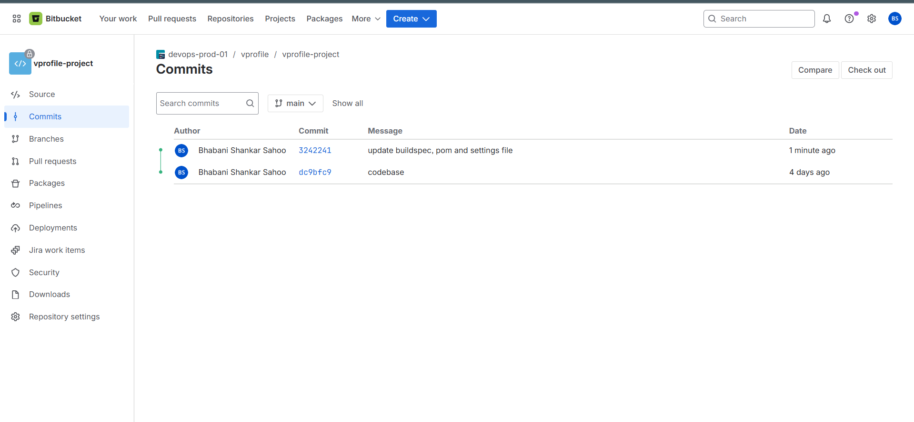

#### 4️⃣ Create the AWS CodeBuild Project

1. Open **AWS Console → CodeBuild**
2. Click **Create build project**
3. Set project name:

   ```text
   vprofile-code-analysis
   ```

#### 5️⃣ Configure Source Provider

- Source provider: **Bitbucket**
- Connection type: **AWS-managed Bitbucket app**
- Select:

  - Repository
  - Branch: `main`

This uses OAuth authentication and avoids storing credentials.

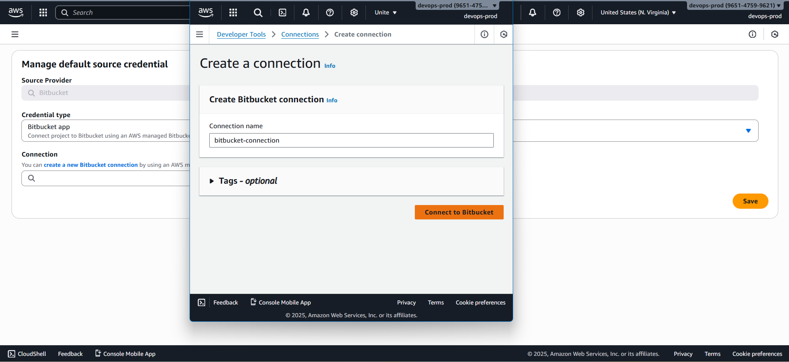

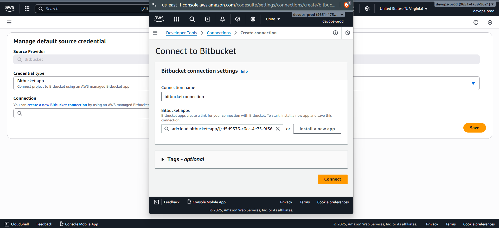

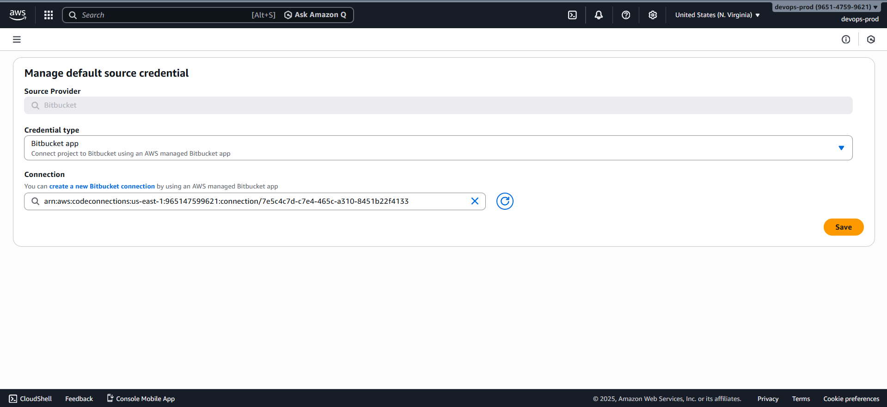

#### 6️⃣ Configure Build Environment

- Environment type: **On-demand**
- Image type: **Managed image**
- OS: **Ubuntu**
- Runtime: **Standard**
- Image version: **Standard 7.0**

> Ubuntu is required because the buildspec uses `apt` commands.

#### 7️⃣ Configure Service Role

- Create a new service role
- Example name:

  ```text
  codebuild-vprofile-code-analysis-07
  ```

> Adding a numeric suffix prevents role-name conflicts if recreated.

#### 8️⃣ Buildspec Configuration

- Select **Use a buildspec file**
- Do not specify a path
- CodeBuild automatically detects `buildspec.yml` in the root directory

#### 9️⃣ Enable CloudWatch Logging

Enable logs for visibility and troubleshooting:

- Log group:

  ```text
  vprofile-codebuild-logs
  ```

- Log stream:

  ```text
  sonar-code-analysis
  ```

Logs are sent to **Amazon CloudWatch**.

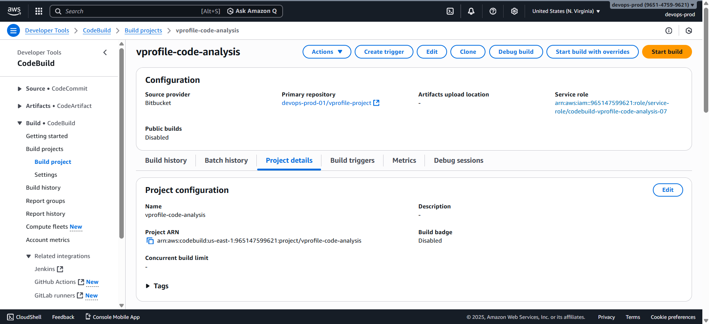

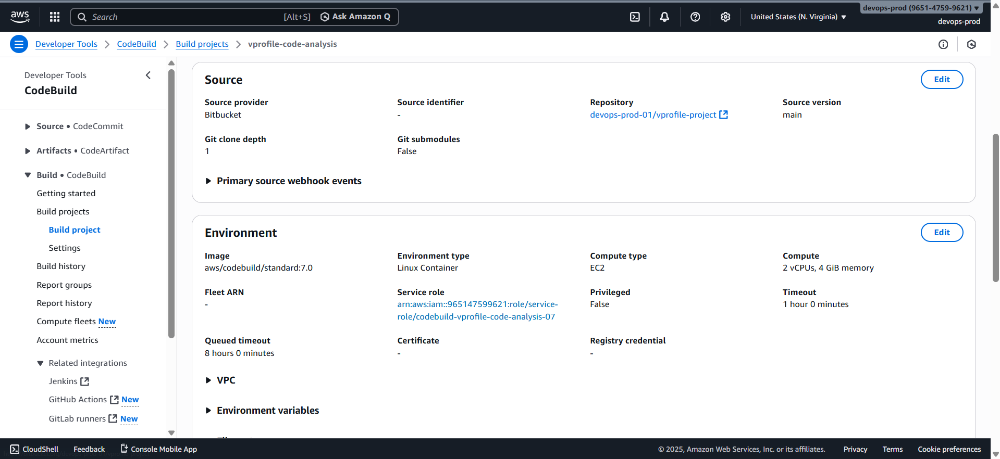

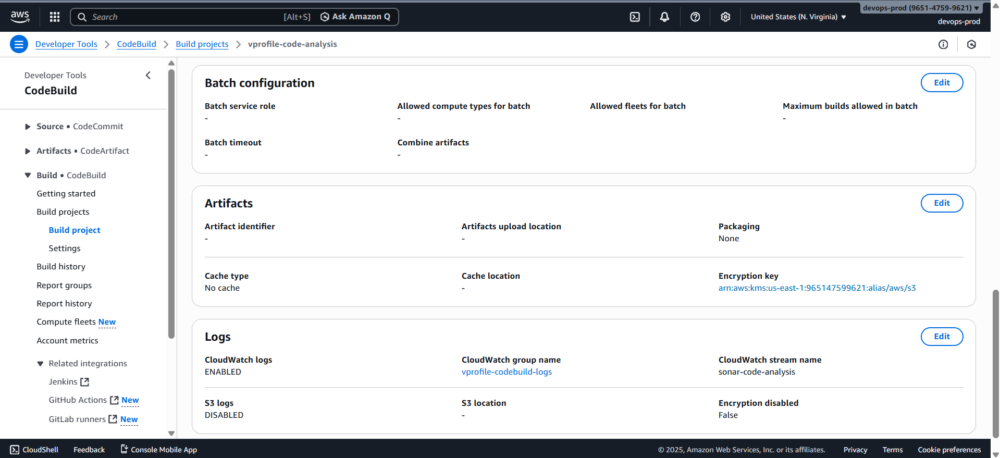

#### 🔐 10️⃣ Update IAM Permissions

Attach the following policies to the CodeBuild service role.

**Parameter Store Read Access (Custom Policy)**

Required permissions:

- `ssm:DescribeParameters`
- `ssm:DescribeDocumentParametes`
- `ssm:GetParameter`
- `ssm:GetParameters`
- `ssm:GetParameterHistory`
- `ssm:GetParametersByPath`

Allows CodeBuild to read SonarCloud credentials securely.

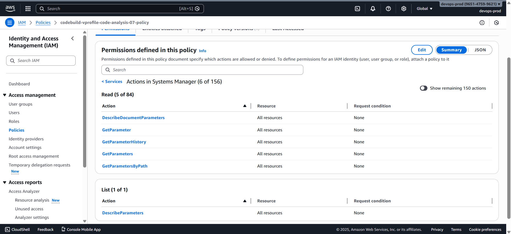


**CodeArtifact Access**

Attach:

- **AWSCodeArtifactReadOnlyAccess**

Allows:

- Token generation
- Maven dependency downloads

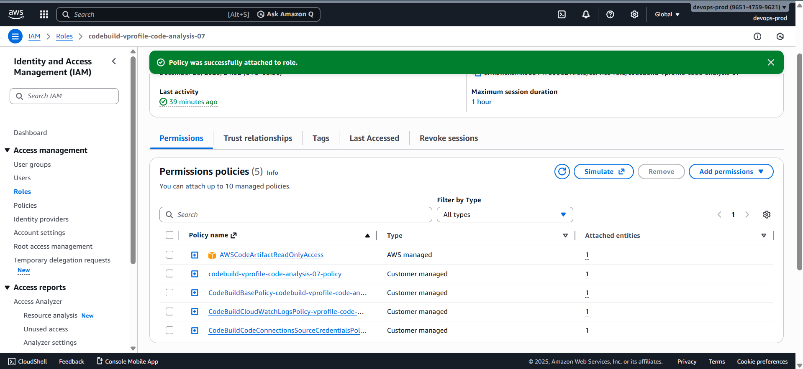

#### ▶️ 11️⃣ Run the Build

1. Open the CodeBuild project
2. Click **Start build**
3. Monitor:

   - **Phase details** (recommended)
   - View logs only if failures occur

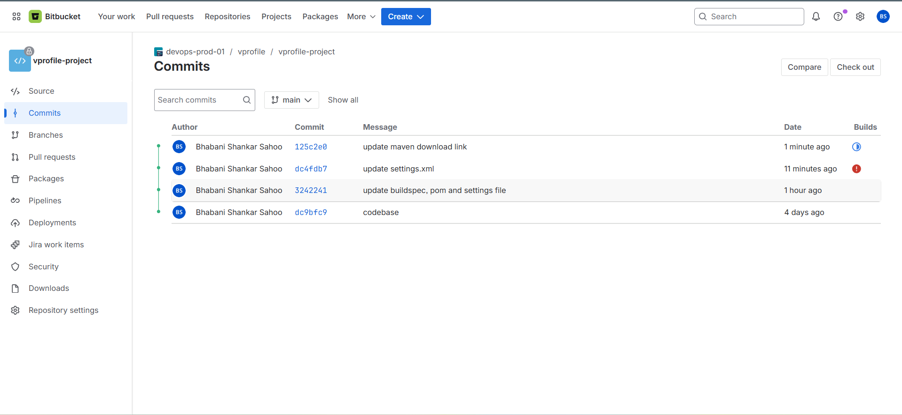

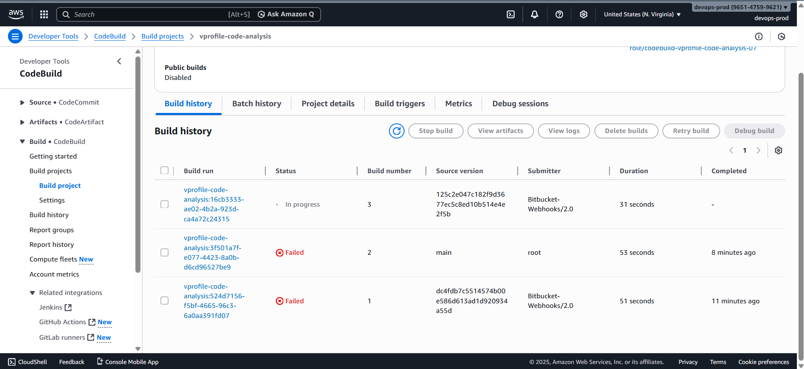

### ✅ Build Result Verification

#### CodeBuild

- Build completes successfully
- All phases pass

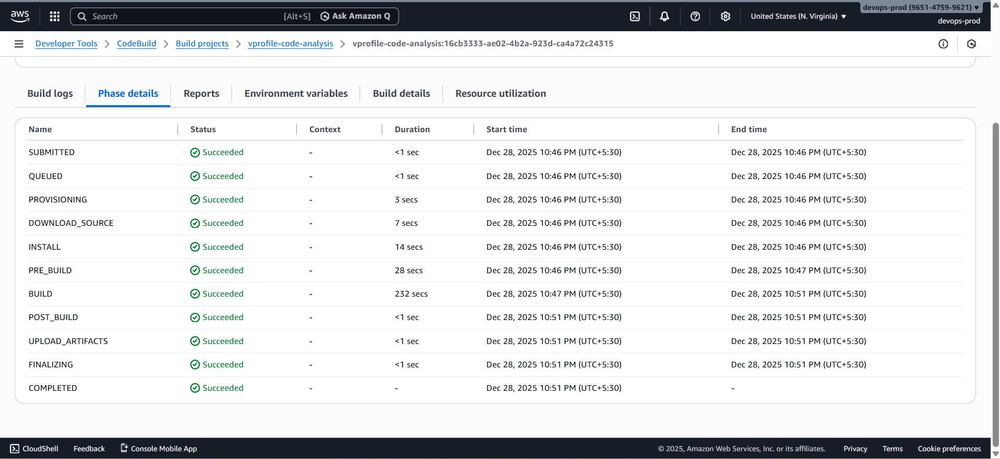

#### SonarCloud

- Open **SonarCloud → My Projects**
- Confirm:

  - Analysis results are uploaded
  - Issues and metrics are visible
  - Quality gate status is applied

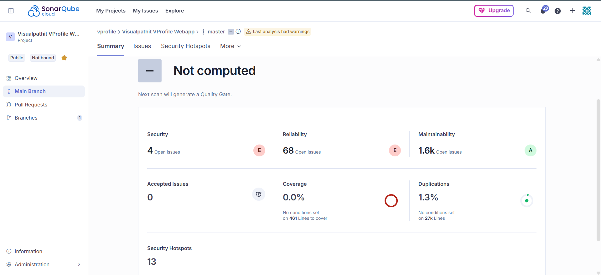
