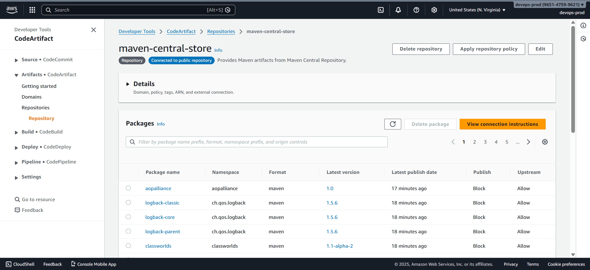
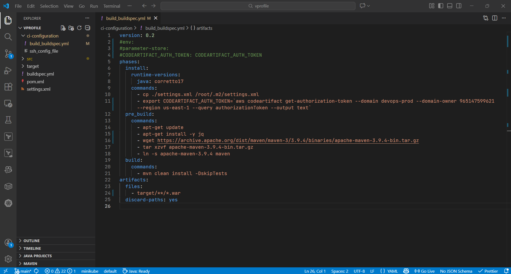
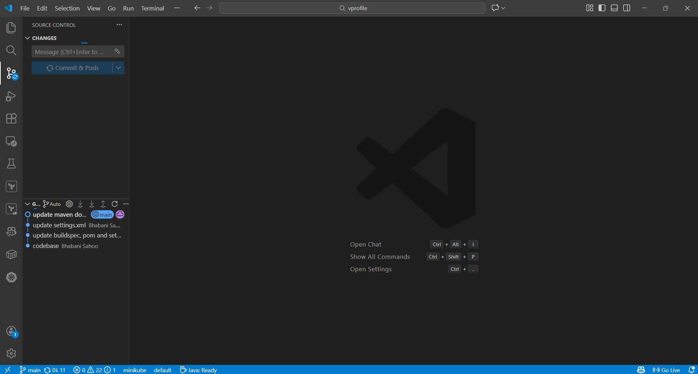
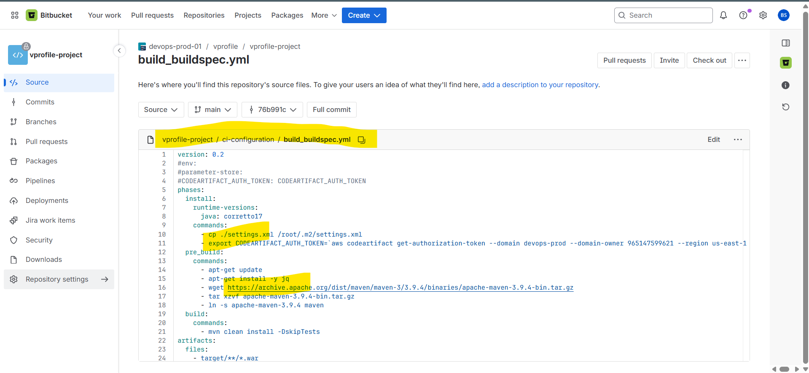
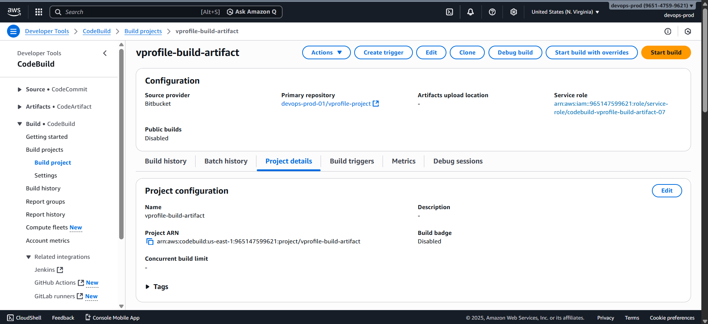
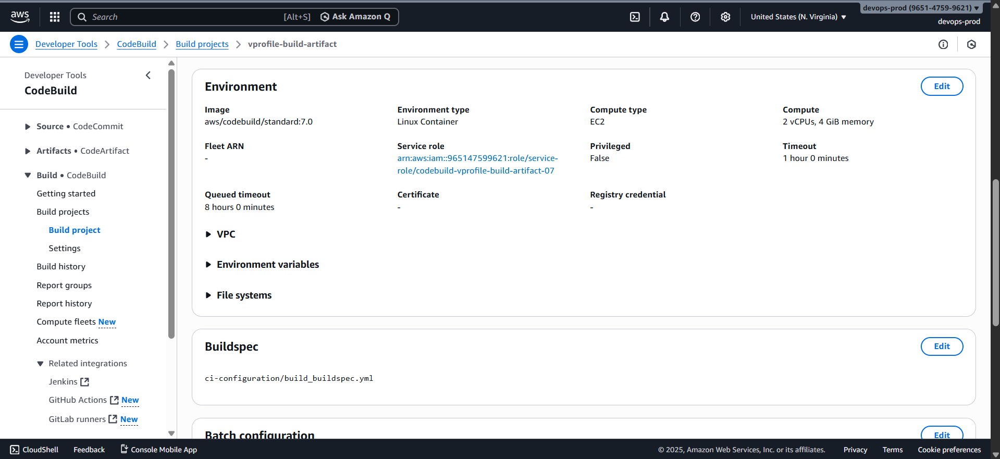
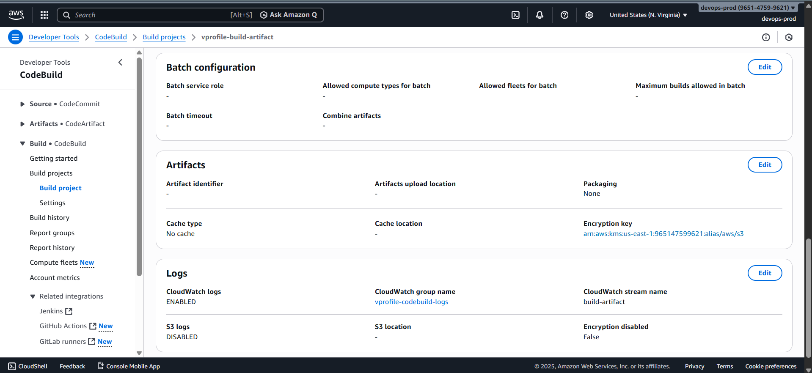
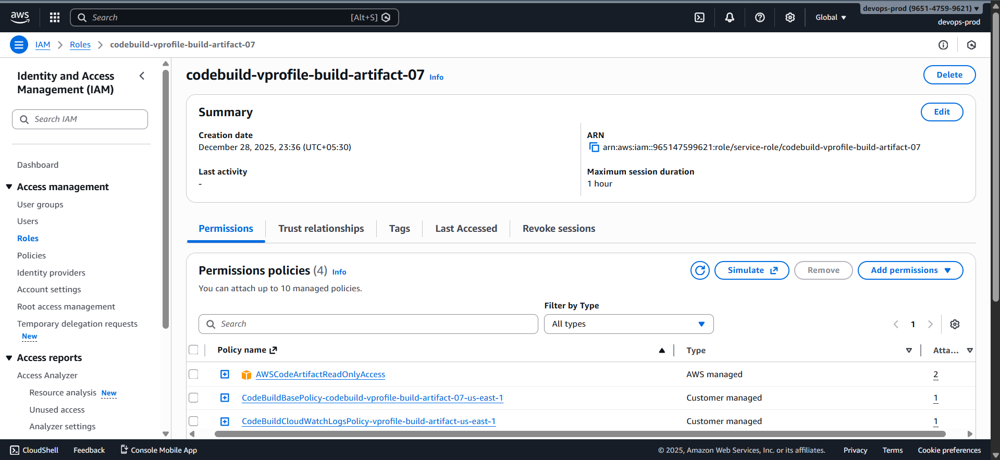
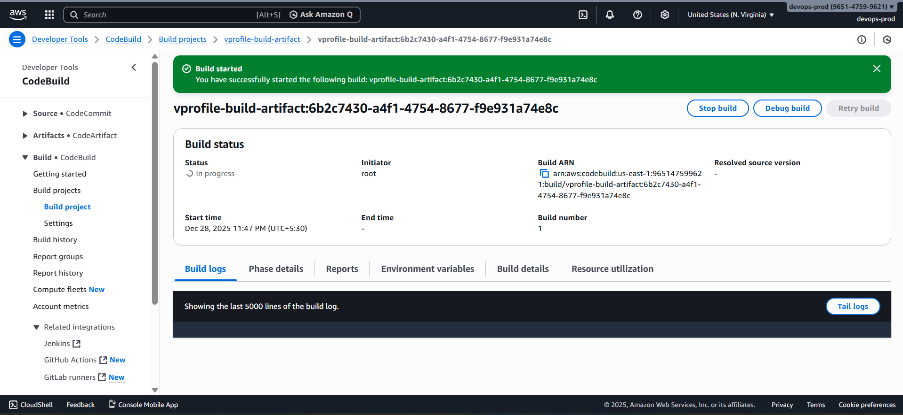
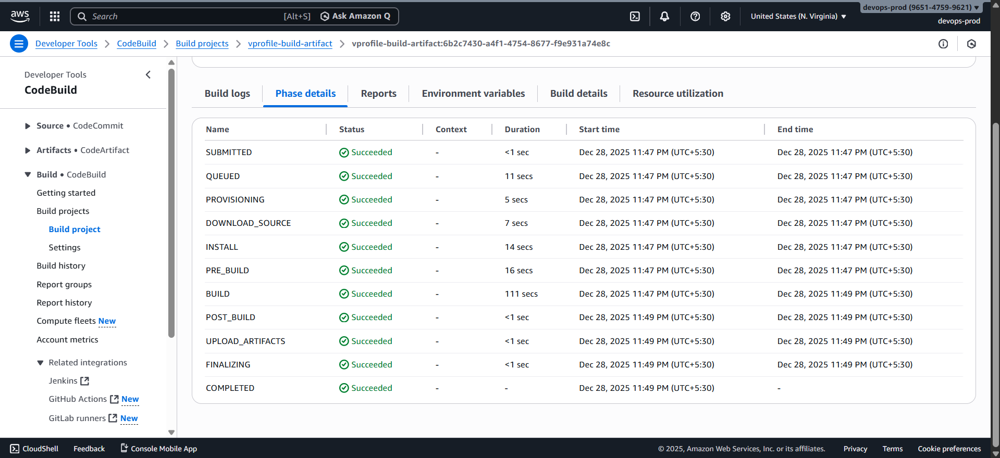

# 🏗️ Creating an AWS CodeBuild Project to Build and Store Artifacts

At this stage of the project, a **CodeBuild job for SonarCloud analysis** is already in place. That job:

- Fetches source code from Bitbucket
- Runs unit tests and static code analysis
- Uploads results to SonarCloud
- Downloads dependencies from AWS CodeArtifact



The next step is to create a **separate CodeBuild project** dedicated to:

- Building the application artifact
- Downloading dependencies from CodeArtifact
- Preparing the artifact for storage in **Amazon S3** via CodePipeline

### 🧩 Architecture Progress So Far

#### Existing Components

- Source repository: **Bitbucket**
- Dependency repository: **AWS CodeArtifact**
- Code analysis job: **AWS CodeBuild**
- Static analysis: **SonarCloud**

#### New Component

- **Artifact build CodeBuild project**

### 📄 Buildspec File for Artifact Build

#### Location

The buildspec file used for artifact creation is located at:

```text
ci-configuration/build_buildspec.yml
```

This file is **separate** from the root-level `buildspec.yml` used for SonarCloud analysis.

### ✏️ Updating the Buildspec File

#### Update CodeArtifact Authentication Command

1. Open **AWS CodeArtifact**
2. Select the Maven repository
3. Click **View connection instructions**
4. Choose:

   - OS: **Mac & Linux**
   - Package manager: **Maven**

5. Copy the command:

   ```bash
   export CODEARTIFACT_AUTH_TOKEN=...
   ```

6. Replace the placeholder export command in `build_buildspec.yml`



### Buildspec Responsibilities

#### Install Phase

- Install **Amazon Corretto 17 (Java 17)**
- Copy `settings.xml` to:

  ```text
  ~/.m2/settings.xml
  ```

- Export the CodeArtifact authentication token

#### Pre-Build Phase

- Run `apt update`
- Install required tools (`jq`)
- Download and configure Maven
- Add Maven binary to the system `PATH`

#### Build Phase

- Run Maven build:

  ```bash
  mvn clean install -DskipTests
  ```

- Tests are skipped because they are already executed in the code-analysis stage

### 📦 Artifact Definition

- Maven generates the artifact in the `target/` directory
- The buildspec artifact section references:

  ```text
  target/**
  ```

- This includes the generated WAR file (e.g., `vprofile-v2.war`)
- The artifact will later be uploaded to **Amazon S3** by CodePipeline

### 📤 Commit and Push Changes

After updating the buildspec:

1. Commit changes to the `main` branch
2. Push to Bitbucket
3. Verify:

   - `ci-configurations/build_buildspec.yml` exists
   - CodeArtifact token export command is correct





### 🚀 Creating Artifact Build CodeBuild job

#### 1️⃣ Create the Build Project

- **Project name:**

  ```text
  vprofile-build-artifact
  ```

#### 2️⃣ Configure Source

- Source provider: **Bitbucket**
- Repository: `vprofile-project`
- Branch: `main`

#### 3️⃣ Configure Build Environment

- Environment type: **On-demand**
- OS: **Ubuntu**
- Runtime: **Standard**
- Image version: **7.0**

These settings match the code-analysis CodeBuild project.

#### 4️⃣ Configure Service Role

- Create a new service role
- Example name:

  ```text
  codebuild-vprofile-build-artifact-07
  ```

This role is separate from the SonarCloud analysis role.

#### 5️⃣ Specify Buildspec Path

Because the buildspec file is not in the root directory, specify:

```text
ci-configurations/build_buildspec.yml
```

> An incorrect path will cause the build to fail with _buildspec file not found_.

#### 6️⃣ Configure Logging

- Log group: same as the code-analysis job
- Log stream:

  ```text
  build-artifact
  ```

Logs are published to **Amazon CloudWatch**.







### 🔐 IAM Permissions for Artifact Build Job

#### Required Policy

Attach the following policy to the service role:

- **AWSCodeArtifactReadOnlyAccess**

This allows the build to:

- Generate CodeArtifact authentication tokens
- Download Maven dependencies

No custom IAM policies are required.



### ▶️ Running the Build Job

1. Open the **vprofile-build-artifact** CodeBuild project
2. Click **Start build**
3. Monitor **Phase details**
4. On failure:

   - Open CloudWatch logs
   - Use _Tail logs_
   - Verify IAM permissions, buildspec path, and configuration



### ✅ Outcome

After a successful build:

- Artifact is generated in the `target/` directory
- CodeBuild completes successfully
- Dependencies are downloaded from CodeArtifact
- Artifact is ready for pipeline consumption


