# 🔗 End-to-End CI Pipeline with AWS CodePipeline

In this stage, all previously created components are connected into a single **end-to-end Continuous Integration (CI) pipeline** using **AWS CodePipeline**.

### 🔌 Components Integrated in the Pipeline

- **Bitbucket** – Source code repository
- **AWS CodeBuild (SonarCloud job)** – Code analysis and quality checks
- **AWS CodeArtifact** – Maven dependency repository
- **AWS CodeBuild (artifact job)** – Application build
- **Amazon S3** – Artifact storage
- **Amazon SNS** – Pipeline notifications

### 1️⃣ S3 Bucket for Pipeline Artifacts

1. Open **Amazon S3**
2. Create a bucket with a **globally unique name**, for example:

   ```text
   vprofile-07-build-artifact
   ```

3. Select the **same region** used by CodeBuild (e.g., `us-east-1`)
4. Create the bucket
5. Inside the bucket, create a folder (object key):

   ```text
   pipeline-artifacts
   ```

> This folder will be used as the deploy destination in CodePipeline.

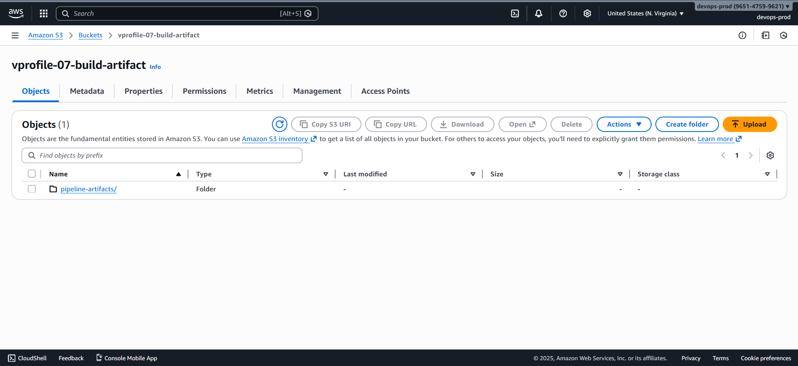

### 2️⃣ Create an SNS Topic for Notifications

1. Open **Amazon SNS**
2. Create a **Standard** topic
3. Topic name:

   ```text
   vprofile-pipeline-notifications
   ```

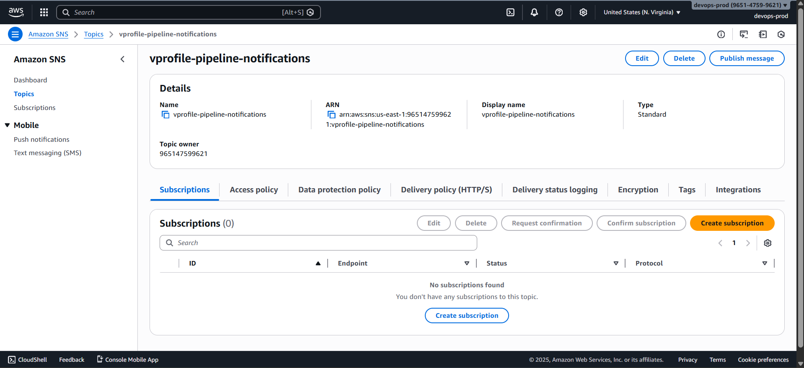

4. Create a subscription:

   - **Protocol:** Email
   - **Endpoint:** Your email address

5. Confirm the subscription via email

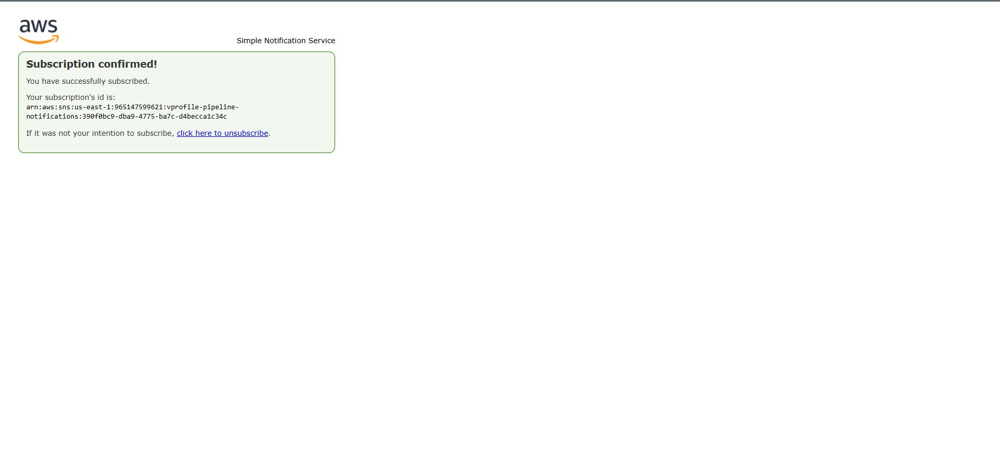

### 3️⃣ Create the CodePipeline

1. Open **AWS CodePipeline**
2. Click **Create pipeline**
3. Pipeline name:

   ```text
   vprofile-ci-pipeline
   ```

4. Allow AWS to create a **service role** and manually configure permission
5. Skip variables and proceed

### 4️⃣ Configure Source Stage (Bitbucket)

- **Source provider:** Bitbucket
- **Connection:** AWS-managed Bitbucket app (OAuth)
- **Repository:** `vprofile-project`
- **Branch:** `ci-aws`
- **Trigger:** No filters (pipeline triggers on every push)

> CodePipeline detects commits; CodeBuild handles fetching and building the code.

### 5️⃣ Configure Build Stage (Artifact Build)

- **Build provider:** AWS CodeBuild
- **Project:**

  ```text
  vprofile-build-artifact
  ```

Continue without adding a deploy stage yet.

### 6️⃣ Stop Auto-Triggered Execution

If the pipeline starts automatically:

- Click **Stop action** on the running execution
- Additional stages must be added before running the pipeline

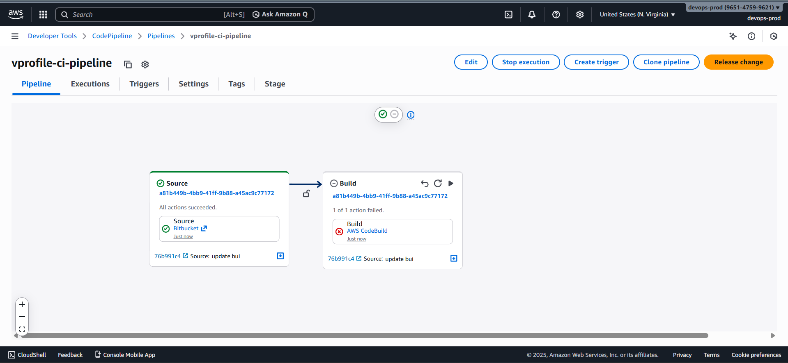

### 7️⃣ Add Code Analysis Stage (SonarCloud)

1. Click **Edit pipeline**
2. Add a new stage after **Source**:

   - **Stage name:** `code-analysis`

3. Add an action:

   - **Action provider:** AWS CodeBuild
   - **Project:** `vprofile-code-analysis`
   - **Input artifact:** Source output
   - **Output artifact:** Not required

4. Save the stage

### 8️⃣ Add Deploy Stage (S3)

1. Add a new stage at the end:

   - **Stage name:** `deploy`

2. Add an action:

   - **Action provider:** Amazon S3
   - **Input artifact:** Output from build-artifact stage
   - **Bucket:** `vprofile-07-build-artifact`
   - **Object key (folder):**

     ```text
     pipeline-artifacts
     ```

   - Enable **Extract before deploy**

3. Save the stage

### 9️⃣ Save the Pipeline

Click **Save** to persist all stage changes.
Unsaved changes will be lost.

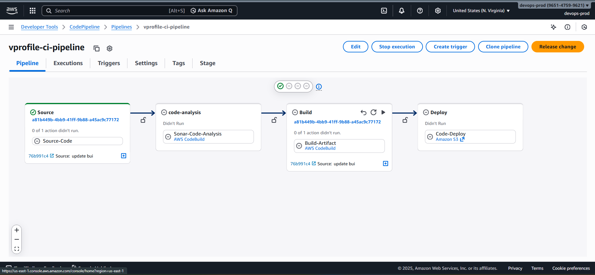

### 🔔 10️⃣ Configure Pipeline Notifications

1. Open pipeline **Settings**
2. Go to **Notifications**
3. Create a notification rule:

   - **Name:**

     ```text
     vprofile-ci-notifications
     ```

   - **Detail level:** Full
   - **Events:** All
   - **Target:** SNS topic `vprofile-pipeline-notifications`

4. Create the rule

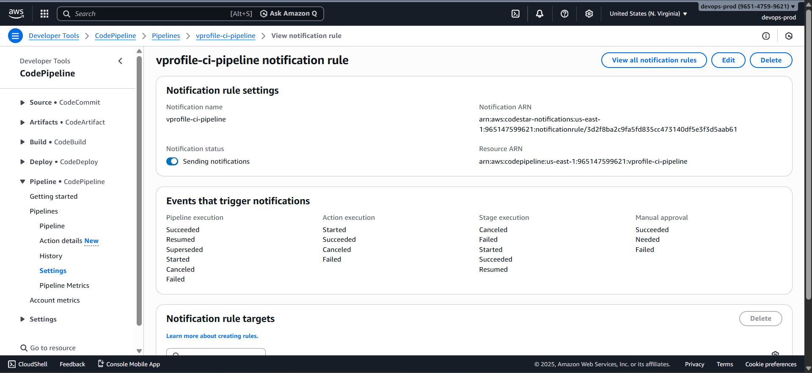

### ▶️ 11️⃣ Trigger the Pipeline

Trigger the pipeline by either:

- Clicking **Release change**, or
- Pushing a new commit to the `main` branch in Bitbucket

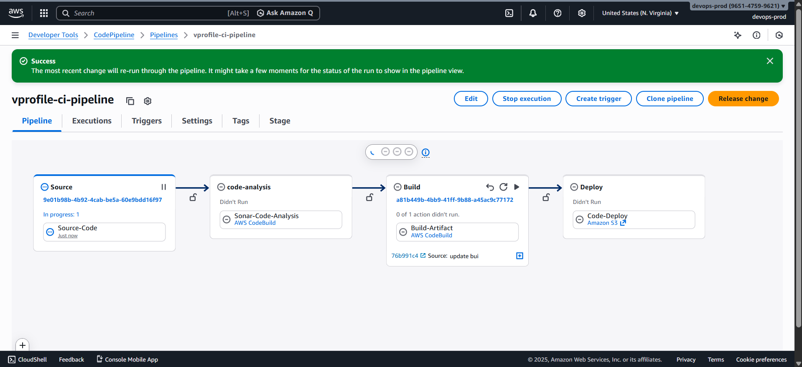

### Pipeline Execution Flow

1. Detects the commit
2. Runs SonarCloud code analysis
3. Builds the application artifact
4. Deploys the artifact to S3
5. Sends SNS notifications

### 🔄 Final CI Pipeline Flow

1. **Source** – Bitbucket
2. **Code Analysis** – CodeBuild + SonarCloud
3. **Build** – CodeBuild (artifact generation)
4. **Deploy** – Amazon S3
5. **Notify** – Amazon SNS

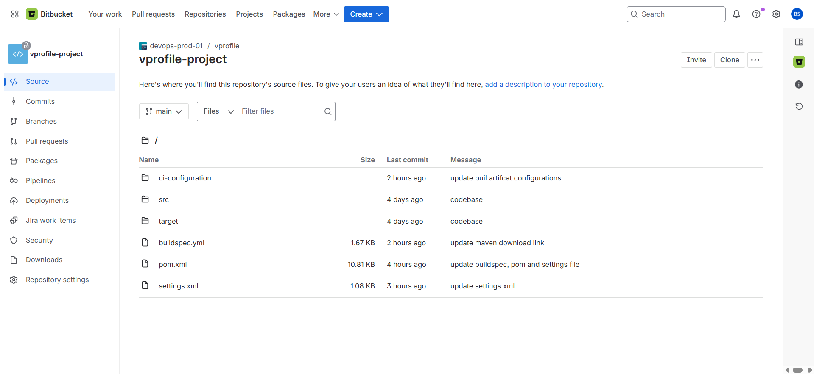

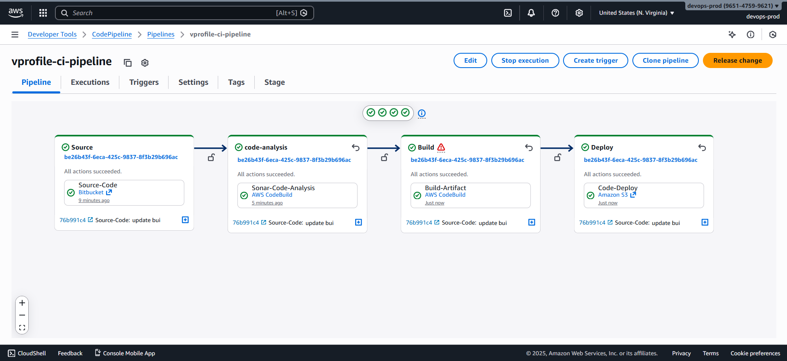


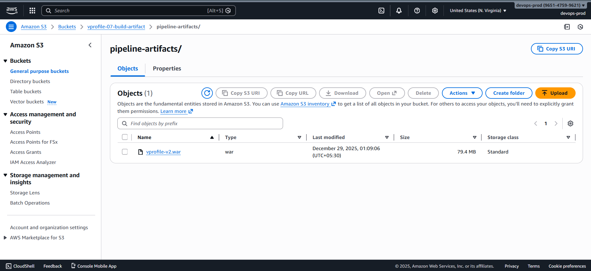

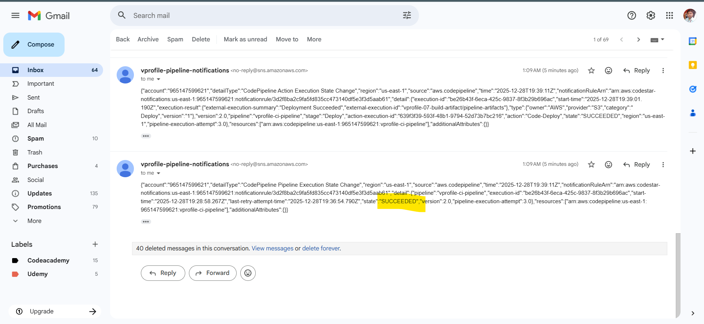
