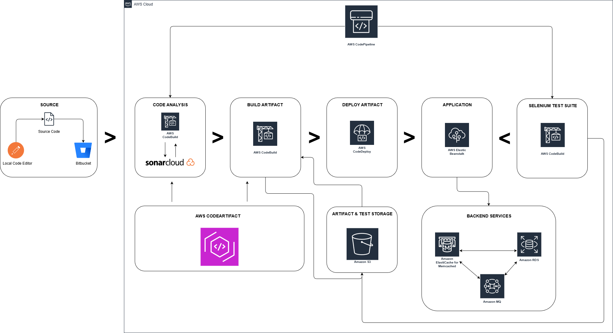

# 🚀 VProfile — AWS CI/CD and Selenium Automation

This repository contains a complete **Continuous Integration (CI)** and **Continuous Delivery (CD)** pipeline for the **VProfile web application**, built entirely on **AWS-managed services** with no EC2 server management required.

The project demonstrates:

- **Automated CI** using AWS CodeBuild with SonarCloud code analysis and quality gates
- **Automated CD** to AWS Elastic Beanstalk with RDS database integration
- **Functional testing** via Selenium automation scripts with TestNG framework
- **PaaS/SaaS-only** deployment model (no manual EC2 management)

## 📋 Table of Contents

- [Quick Start](#quick-start)
- [Project Structure](#project-structure)
- [Technology Stack](#technology-stack)
- [CI Pipeline](#ci-pipeline)
- [CD Pipeline](#cd-pipeline)
- [Selenium Testing](#selenium-testing)
- [AWS Environment Setup](#aws-environment-setup)

## 🏃 Quick Start

### ✅ Prerequisites

- **Java**: JDK 17 (Corretto 17 as per buildspec)
- **Maven**: 3.9.4 or later
- **AWS Console**: Configured with appropriate credentials and region
- **Browser**: Chrome with matching ChromeDriver for Selenium tests
- **Code Artifact Access**: AWS CodeArtifact credentials for Maven dependency pulling

## 📁 Project Structure

```
06_vprofile_aws_cicd/
├── CI/                          # Continuous Integration artifacts
│   ├── Deployment/              # CI setup & pipeline documentation
│   │   ├── 00_ci_introduction.md
│   │   ├── 01_code_setup.md
│   │   ├── 02_code_artifact_setup.md
│   │   ├── 03_sonar_cloud_setup.md
│   │   ├── 04_parameter_store.md
│   │   ├── 05_code_analysis.md
│   │   ├── 06_build_artifact.md
│   │   └── 07_codepipeline_and_sns.md
│   ├── Resources/Images/        # Documentation images
│   └── vprofile/                # Main application for CI
│       ├── buildspec.yml        # CodeBuild specification (SonarCloud analysis)
│       ├── pom.xml              # Maven POM (Java 17, Spring 6.0.11, Boot 3.1.3)
│       ├── settings.xml         # Maven settings for CodeArtifact
│       ├── src/                 # Application source code
│       │   ├── main/java/       # Main application code
│       │   ├── main/resources/  # Config files, DB schema (accountsdb.sql)
│       │   └── test/java/       # Unit tests
│       └── target/              # Compiled artifacts, reports, generated sources
│
├── CD/                          # Continuous Deployment artifacts
│   ├── Deployment/              # CD setup & deployment documentation
│   │   ├── 00_introduction.md   # CD philosophy & PaaS/SaaS approach
│   │   ├── 01_beanstalk_setup.md
│   │   ├── 02_rds_setup.md      # MySQL database setup
│   │   ├── 03_sg_and_db_initialization.md
│   │   ├── 04_code_update.md    # Application properties updates
│   │   ├── 05_branch_and_ps_update.md
│   │   ├── 06_build_job_setup.md
│   │   ├── 07_testing_job.md    # Post-deployment Selenium tests
│   │   └── 08_pipeline_setup.md
│   ├── Resources/Images/        # Documentation images
│   ├── seleniumAutoScripts/     # Functional test automation
│   │   ├── pom.xml              # Selenium + TestNG + JUnit dependencies
│   │   ├── testng.xml           # TestNG suite configuration
│   │   ├── ChromeDriver/        # Chrome driver binaries
│   │   ├── ScrnShts/            # Test screenshots
│   │   ├── src/test/java/       # Test source code
│   │   └── test-output/         # Test execution reports (HTML, XML)
│   │       └── CI_CD_TEST/      # Pipeline execution test results
│   └── vprofile/                # Application for CD deployment
│       ├── pom.xml
│       ├── settings.xml
│       ├── cd-configuration/    # CD-specific buildspecs
│       │   ├── build_buildspec.yml
│       │   ├── buildAndStore_buildspec.yml
│       │   ├── buildAndRelease_buildspec.yml
│       │   ├── sonar_buildspec.yml
│       │   ├── win_buildspec.yml
│       │   └── ssh_config_file
│       └── src/                 # Application source
│
└── README.md                     # This file
```

## 🛠️ Technology Stack

### ☕ Application Stack

| Component           | Version       | Purpose                      |
| ------------------- | ------------- | ---------------------------- |
| Java                | 17 (Corretto) | Runtime environment          |
| Spring Framework    | 6.0.11        | Web framework                |
| Spring Boot         | 3.1.3         | Application bootstrap        |
| Spring Security     | 6.1.2         | Authentication/Authorization |
| Spring Data JPA     | 3.1.2         | Data persistence             |
| Hibernate ORM       | 7.0.0.Alpha3  | ORM layer                    |
| MySQL Connector     | 8.0.33        | Database driver              |
| Apache Commons DBCP | 2.12.0        | Connection pooling           |
| JUnit               | 4.13.2        | Unit testing                 |
| Logback             | 1.5.6         | Logging framework            |

### 🔧 CI/CD Tools & Services

| Service                 | Purpose                                      |
| ----------------------- | -------------------------------------------- |
| **AWS CodeBuild**       | Build and test automation (Java Corretto 17) |
| **AWS CodePipeline**    | Orchestrate CI/CD workflow                   |
| **AWS CodeArtifact**    | Maven dependency repository                  |
| **SonarCloud**          | Code quality & security analysis             |
| **AWS Parameter Store** | Secrets & configuration management           |
| **AWS SNS**             | Pipeline notifications                       |

### 🧪 Testing & Deployment

| Tool                      | Purpose                       |
| ------------------------- | ----------------------------- |
| **Selenium WebDriver**    | Browser automation testing    |
| **TestNG**                | Test framework & reporting    |
| **Apache Maven**          | Build automation (3.9.4)      |
| **AWS Elastic Beanstalk** | Application deployment (PaaS) |
| **Amazon RDS**            | Managed MySQL database        |
| **AWS Security Groups**   | Network access control        |

## 🔄 CI Pipeline

### 👀 Overview

The CI pipeline automatically triggers on code commits and performs:

1. **Build & Test**: Maven compiles code and runs unit tests
2. **Code Analysis**: SonarCloud scans for bugs, vulnerabilities, and code smells
3. **Quality Gate**: Fails the build if SonarCloud quality gate returns `ERROR`
4. **Notifications**: SNS sends results to developers via email/Slack

## 📦 CD Pipeline

### 👀 Overview

The CD pipeline deploys the application to AWS Elastic Beanstalk after CI passes:

1. **Build & Package**: Create deployable WAR artifact
2. **Store Artifact**: Upload to AWS CodeArtifact / S3
3. **Deploy**: Push to Elastic Beanstalk environment
4. **Post-Deploy Testing**: Run Selenium tests against live environment

### 🏗️ Deployment Architecture (PaaS/SaaS)



```
Developer Commit
    ↓
CodePipeline Trigger
    ↓
CodeBuild (Build & Store)
    ↓
Elastic Beanstalk Deploy
    ↓
RDS MySQL Database
    ↓
CodeBuild (Selenium Tests)
    ↓
SNS Notification
```

**No EC2 instance management required** — Elastic Beanstalk handles scaling, patching, and updates automatically.

## 🌐 Selenium Testing

### 🤖 Functional Test Suite

The Selenium automation validates the deployed application in a real browser:

**Location**: [CD/seleniumAutoScripts/](CD/seleniumAutoScripts/)

**Key Files**:

- `pom.xml` — Selenium, TestNG, JUnit dependencies
- `testng.xml` — Test suite configuration
- `src/test/java/` — Test classes
- `ChromeDriver/` — Chrome WebDriver binary
- `test-output/` — Execution reports

### 📊 Test Reports

After execution, reports are generated in:

- `test-output/index.html` — TestNG HTML report
- `test-output/testng-results.xml` — XML results
- `test-output/junitreports/` — JUnit format reports
- `test-output/CI_CD_TEST/` — Pipeline execution results

### ✔️ Post-Deployment Testing

In the CD pipeline (see [07_testing_job.md](CD/Deployment/07_testing_job.md)), a CodeBuild job:

1. Retrieves Elastic Beanstalk URL
2. Updates test configuration with live app URL
3. Runs Selenium tests against the deployed application
4. Reports results back to the pipeline

## ☁️ AWS Environment Setup

### 🔨 Detailed Setup

Follow the step-by-step guides in [CD/Deployment/](CD/Deployment/) for complete AWS resource configuration.

## 📚 Key Contacts & Resources

- **SonarCloud Docs**: https://docs.sonarcloud.io
- **AWS CodeBuild Docs**: https://docs.aws.amazon.com/codebuild
- **AWS Elastic Beanstalk Docs**: https://docs.aws.amazon.com/elasticbeanstalk
- **Selenium Docs**: https://www.selenium.dev/documentation
- **TestNG Docs**: https://testng.org/doc
